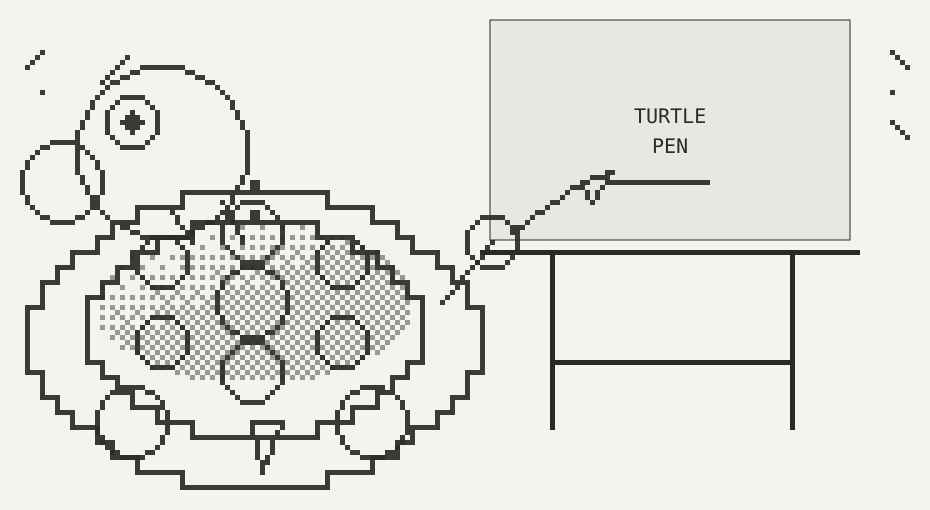

# TurtlePen



An integer-exact grid substrate for **AI-authored diagrams**, with a turtle/pen
command language, measurement before placement, and severity-ranked collision
reporting across Z-page overlays.

Status: **prototype**, full automated suite green, zero runtime dependencies.

## The problem it solves

Every mainstream diagram tool measures text at *render* time — inside the
browser or renderer, long after the author has already chosen the box size and
committed. A human catches the overflow instantly by eye. An AI has no eye, so
it produces sloppy output: text that doesn't fit its box, lines that cross
shapes, layers that collide, and nothing anywhere that says so.

TurtlePen inverts that. Measurement happens **before** placement, every
coordinate is an integer, and every defect is reported with a severity and a
numeric fix. Nothing is ever silently resized — the engine measures and reports,
and the AI decides.

## The lattice

```
1 cell  = 10 x 10 px          1 quadrant = 5 x 5 px          strokes = 5px thick
┌────┬────┐
│ q1 │ q2 │   Every legal position is a whole number of quadrants, so results
├────┼────┤   are byte-identical across runs. A collision report is a fact,
│ q3 │ q4 │   not an approximation, and tests assert exact cell sets.
└────┴────┘
```

Addressing is Excel's: columns `A…Z, AA…`, rows `1, 2, 3…`, origin `A1`
top-left, unbounded right and down. There is no negative addressing, so every
address parses unambiguously — start at an inset origin such as `T20` if a
drawing may need to grow up or left.

Three precisions are accepted anywhere a location is expected:

| Form | Meaning | Size |
|---|---|---|
| `C4` | whole cell | 10 × 10 px |
| `C4.tl` | pin point — 9 per cell (`tl t tr l c r bl b br`) | lattice point |
| `C4.q2` | quadrant — 4 per cell | 5 × 5 px |

## The pen

The AI walks a cursor around the lattice laying down strokes and junction
pieces, rather than declaring endpoints and hoping a router does something sane.
Every stroke has an explicit author and an exact footprint, so a collision can
name the step that caused it.

```
pen J8.q1                              # place the cursor
down 2 align right line                # 2 cells of 5px stroke, hugging the right half
down corner align top right            # arrives from the top, leaves to the right
right 3 align top line
right corner align left bottom         # arrives from the left, leaves downward
down align left line to queue.N arrow  # engine counts the distance; run ends in an arrowhead
```

- **Distances count whole 10px cells.** Strokes are 5px, so `align` picks which
  half of the cell they hug: `left|right` for vertical, `top|bottom` for
  horizontal. There is deliberately no `center` — a 5px stroke centred in a 10px
  cell would start at 2.5px, off the lattice.
- **Locations may appear on any command** (`at C7.q2`, or bare `(C7.q2)`), so
  relative walking and absolute re-anchoring mix freely. An error stays
  contained to the run between two absolute locations.
- **`to <address>` or `to <id>.<port>`** draws until it reaches a target and
  reports the distance travelled, so the AI never has to count cells to a box
  whose size came from measured text.
- **Indexed cardinal ports fan out competing connectors.** `gateway.S#1` is
  the existing midpoint, `S#2` is one cell left, `S#3` one cell right, then the
  sequence alternates outward by whole cells. The same syntax works on targets
  (`to worker.N#2`). `place_box` and `describe` report each face's slot capacity;
  an out-of-range slot is rejected rather than clamped onto another track.
- **A corner names the two sides it connects**, one of which must be the side
  the path arrives on. Styles: `square rounded indented chamfered`.
- **`arrow` on a `line` command turns the run's last quadrant into the
  arrowhead**, rather than adding one after it — so `line to db.W arrow` points
  at a box without overlapping it. Standing alone, `<dir> arrow` places a head
  at the cursor.
- **An omitted `align` continues on the track the cursor is already on.** A
  fixed default would fight a deliberately seated cursor.

## Shapes: anything that is not a rectangle

The lattice is orthogonal, so a diagonal, a circle and an arc are the same kind
of thing — a computed set of whole quadrants. These are the classic integer
algorithms, chosen for the reason they were invented and the reason this project
exists: they are exact.

**They are starting points, not results.** A single `circle` is one gesture; a
composition is what you build from several, related by anchors and varied
deliberately. `validate` now says so out loud — `C001` reports a document whose
densest page has too little ink to have been composed at all.

The worked example to measure against is `diagrams/art-deco-hero.svg`, drawn
entirely on these primitives and inking 11% of its canvas. A page that reaches
for one primitive and stops will typically ink under 1%.

```
ray to AF20.q1        a straight line at ANY angle (Bresenham)
circle 12             outline (midpoint); radius in QUADRANTS, not cells
disc 12               the same circle, filled
arc 12 0 90           part of it, clockwise from east
triangle M4.q1 T9.q1  three points; polygon takes more
dash 6 se             six quadrants diagonally — the morse dash
dot                   one quadrant — the morse dot
```

`dir8` is `n ne e se s sw w nw`, and `up/down/left/right` still work. A stepped
diagonal is not an approximation of a smooth line; on a lattice it **is** the
line, which is how interface art was drawn on 1-bit displays.

## Anchors and durable relationships

Connectors got `pen from <id>.<face>` early, because a hand-computed address is
where the mistakes live. Shapes did not, so every part of the first logo was an
absolute coordinate and the proportions drifted. An anchor fixes that during
authorship: the relationship is resolved from the target's current footprint
when the program runs, instead of being recomputed by the author.

```
pen at shell.C                       put the cursor ON an element
circle 15 at shell.N                 anchor a shape to one
circle 7 at head.W offset -3 4       nudge in whole quadrants
```

`from` gives the **seat**, one step *outside* the element, where a connector
starts. `at` gives the **anchor**, on the element, where a shape belongs.
Anchors are `N NE E SE S SW W NW C`, and work on anything with a footprint —
including a drawn path, whose footprint is computed from the quadrants it covers.

Placement anchors remain declarative inputs: rerunning the same program after
changing `shell` recomputes a placement. For an existing element that must keep
following another, store an explicit relationship instead:

```json
{ "action": "create", "id": "label-follows-unit",
  "dependent": "label", "target": "unit",
  "dependentAnchor": "W", "targetAnchor": "E",
  "offsetX": 2, "offsetY": 0 }
```

`constraint` supports `list`, `create`, `delete`, and `sync`. A dependent has one
parent; chains cascade, cycles are refused, offsets are exact quadrants, and
relationships survive save/open. Moving, resizing, or redrawing a target moves
its dependents. Manually moving a dependent authors a new offset. `describe`
reports both sides and whether stored and actual offsets are synchronized.

> **Corner anchors are bounding-box corners.** On a rectangle that is what you
> want. On an ellipse or any organic shape, `SW` is the corner of the box around
> it, which is empty space — anchoring feet there puts them off the body. Use
> the edge midpoints (`N S E W C`) with an offset for anything not rectangular.

## Tracing over a reference

```
place_reference { source: "ref.png", span: "40x24" }
… draw over it …
remove_page { id: "reference" }
```

The image is dithered onto the lattice — so it is made of the same quadrants you
will draw in — put on a page below the base at 0.25 opacity, and flagged. `L020`
reports it until you remove it, because scaffolding that ships is worse than no
scaffolding.

**Closed shapes are not connectors.** A path that returns to its start is marked
`closed`, and the rules about dangling ends and retraced quadrants do not apply
to it — they are about connectors, and applying them to an outline is how a rule
cries wolf.

**Open artwork is not a connector either.** Set `role: "artwork"` on `pen` (or
inside `plan`) to draw branches, contours, and other intentionally open marks
without connector-only `L008`/`L015` findings. Artwork may also declare a hex
`color`, a `width` from 1–5px, and `cap: "butt"|"round"|"square"`. Those are
presentation properties: the collision engine still claims the exact integer
quadrants, while the SVG paints a simplified continuous line through them.
Set `paint: "cells"` to colour every claimed quadrant instead; this is how the
canonical logo builds solid forms without embedding a bitmap or weakening
collision geometry.

- **`hop` marks a deliberate crossing.** It renders as a bridge arc and exempts
  that quadrant from the stroke-overlap rule, so an intended crossing is not
  reported as a defect. It still claims its quadrant, so a hop through a box is
  still an error.

## Connectors: the two mistakes worth knowing

Both of these came out of an actual authoring session, not from theory. The
first run of `examples/agent-session.js` produced four broken connectors from
entirely reasonable-looking code.

**1. Don't compute the start address yourself.** A box's south face is already
outside it, but its north face *is* the box's own top row — so leaving northward
starts one quadrant higher. Getting this wrong puts a one-quadrant gap between
the connector and the box, which reads as a dangling end. Use the seat instead:

```
pen from gateway.S          # seated just outside, already facing down
down line to checkout.N arrow
```

When several paths leave that face, index the seats instead of merging their
first run:

```
pen from gateway.S#2        # one full cell left of the midpoint track
down line to worker.N#2 arrow
```

`place_box` and `describe` report the default seat address and slot capacity for
every face, so neither the coordinate nor the valid index range has to be
derived.

**2. `to <id>.<port>` sets a distance, not a destination.** It measures along
the direction of travel only. A run on the wrong row or column stops *level
with* its target and never touches it. That is legitimate on an intermediate leg
— "go right until level with it, then turn" — so it is checked against the
finished path, and reported as `L016` with the gap quantified if the path never
arrives.

## Corner styles participate in collision

A rounded, chamfered, or indented box does not visually occupy its four corner
quadrants, so its **claimed** footprint is larger than its **visual** one. A
stroke through an indented corner is reported as information (`L013`), not as an
error (`L004`). Without that distinction the engine would flag collisions a
human eye would not see — which trains an AI to ignore the log.

## Z-pages

Overlapping is a mistake on one layer and the entire point on another, and
geometry alone cannot tell which. So each page declares its intent:

| Intent | Overlap with lower pages |
|---|---|
| `exclusive` | `L005` **error** — nothing below may be overlapped |
| `overlay` | `L010` **information** — expected, so annotation layers stay quiet |

Within a single page, overlap is always an error regardless of intent.

## Collision rules

| Rule | Sev | What it catches |
|---|---|---|
| `L001` | S0 critical | two elements claim the same quadrants on one page |
| `L012` | S0 critical | duplicate element id — targets become ambiguous |
| `L002` | S1 error | measured text wider than the box interior |
| `L003` | S1 error | wrapped text needs more lines than the box shows |
| `L004` | S1 error | a path runs through the inked body of a box |
| `L005` | S1 error | an exclusive page overlaps content below it |
| `L021` | S1 error | opaque overlay content obscures a lower text run |
| `L006` | S2 warn | two paths share a quadrant with no junction or hop |
| `L007` | S2 warn | two boxes touch with no separating quadrant |
| `L008` | S2 warn | a path ends without meeting a box or another path (one finding per path, not per end) |
| `L009` | S2 warn | font size below the 8px legibility floor |
| `L011` | S2 warn | an element extends past the declared canvas |
| `L014` | S2 warn | a stroke drawn on a track the cursor was not on |
| `L015` | S2 warn | a path re-draws a quadrant it already covered |
| `L016` | S2 warn | a path named a destination but stops short of touching it |
| `L020` | S2 warn | a temporary tracing-reference page is still present |
| `L022` | S2 warn | a rasterized image has enough neighboring ink changes to obscure its identity |
| `L023` | S2 warn | continuous-tone source was simplified without semantic understanding |
| `L010` | S3 info | expected overlap from an overlay page |
| `L013` | S3 info | a path crosses a claimed but un-inked corner cut |
| `C001` | S3 info | sparse canvas — too little ink to have been composed; compose it, or declare the page `schematic` |

## The workflow

**measure → plan → commit → adjudicate → render → look.**

`plan` is the centre of it: send the whole composition as a batch of operations
and read the collision log *before* anything is written. The document is
untouched until the same batch is re-sent with `commit: true`, and a batch that
fails part-way applies nothing at all — a half-applied composition would leave
the document in a state nobody asked for.

`free_space` searches the whole non-reference page stack by default, including
hidden pages because they are still validated. Its response names the effective
`scope`, target, and every page searched. Use `scope: "page"` only when overlap
with other pages is intentional; tracing references are excluded because their
declared purpose is to be drawn over. `cellsW` and `cellsH` must be supplied
together, so an incomplete fit query cannot silently turn into list mode.

`describe { region: "C4:AZ40" }` keeps large-document reads bounded. Boxes,
text, and images intersect by their claimed rectangles; paths are checked piece
by piece, so an empty area inside an L-shaped path's bounding box is not returned.
The response preserves the normal per-page array and includes the normalized
effective filter. Combine `page` and `region` to narrow both dimensions.

`history` is the recovery path for a committed edit that proves wrong. It keeps
the newest 100 successful mutations by default (configurable from 1–1000 with
`TURTLEPEN_HISTORY_LIMIT`); failed and no-op calls consume no entry, and a
divergent edit after undo clears redo. Undo, redo, and `clear` update a versioned
`<diagram>.history.json` sidecar immediately. The sidecar is bound to the exact
document hash, so history survives open and MCP restart while an outside edit
invalidates stale recovery instead of applying it to the wrong state.
Composition source is part of the document: reopening a wireframe still
supports `export_prompt`, and perspective inputs remain available as provenance.
`export_prompt` first checks the generated boxes and routed paths against the
live document. If later editing made the source stale, it names the first stale
element and refuses to emit an obsolete layout; undo the edit or rerun
`wireframe` to establish a new source.

```
plan  { operations: [ …place boxes, run pen programs… ] }
  → rehearsed 6 operation(s) on a copy — the document is unchanged.
    [ERROR] L002 "audit" label needs 48px but the interior is 50px …
            fix: widen box to 7 cells

…adjust the plan, not the document, then…

plan  { operations: […], commit: true }
  → committed 6 operation(s).  status: CLEAN
```

Placement is never blocked for collision, so sketching roughly and repairing
afterwards works too — the AI is not fighting per-call rejections either way.

Adjudication is where intent is declared. `accept_finding` records a finding as
deliberate, keyed to a fingerprint derived from the rule, page, actors and exact
quadrants. If the geometry later changes, the fingerprint changes with it and
the acceptance lapses automatically — so "I meant that" can never quietly
suppress a genuinely new problem.

## Every fix has a tool

The collision engine only suggests repairs it can actually perform. A diagnostic
vocabulary that outgrows the action vocabulary strands the AI in a loop it
cannot exit, so these are kept a closed set — and a test asserts it.

| Fix kind | Tool |
|---|---|
| `widen`, `heighten` | `resize` |
| `shorten`, `font` | `restyle` |
| `move` | `move` |
| `rename` | `rename` |
| `intent` | `update_page` |
| `canvas` | `set_canvas` |
| `extend` | `extend_path` |
| `reroute`, `offset`, `hop` | `replace_path` |
| `remove` | `remove` or `remove_page` according to target kind |

## Running it

```bash
pnpm run check                         # full test suite + examples, logo, and tree
pnpm test                              # automated test suite
pnpm run test:endpoints                # MCP, HTTP, and WebSocket surface contract
node examples/build-example.js         # the plan -> commit cycle, end to end
node examples/agent-session.js         # an agent authoring a real diagram over MCP
node examples/constraint-stress.js      # crowded same-face rehearsal and rework over MCP
node examples/rework-session.js         # commit, detect, undo, redo, reopen over MCP
pnpm run field-guide                    # build the condenser replacement field workflow over MCP
pnpm run image-session                  # exercise embed, dither, simplify, and review/reference gates over MCP
pnpm run random-images                  # compare direct 1x and 4x->1x simplify across five seeded-random sources
pnpm run logo                          # regenerate the canonical 1200x1200 logo
pnpm run tree                          # regenerate the 540x960 branching-tree study
node src/viewer/server.js --doc diagrams/example.turtlepen.json
node src/mcp/server.js                 # MCP over stdio
```

Register the MCP server with any MCP-aware agent. Use the absolute path to your
own clone — `args` is resolved by the agent, not by a shell, so `~` and relative
paths do not expand:

```json
{ "mcpServers": { "turtlepen": {
    "command": "node",
    "args": ["/absolute/path/to/turtlepen/src/mcp/server.js"]
} } }
```

There is nothing to install first: no runtime dependencies, Node 20 or newer.
Clone it, point the config at `src/mcp/server.js`, and run `pnpm test` once to
confirm the clone is sound.

35 tools. Call `turtlepen_help` first — it returns the grammar, the lattice
constants, the rule table, and the fix→tool map.

The maintained [endpoint and use-case coverage matrix](docs/endpoint-use-case-coverage.md)
maps every transport, tool, viewer route, and known workflow to executable evidence.

The project also ships a practical work product authored through the real MCP
transport: [Condenser replacement field workflow](diagrams/condenser-replacement-field-guide.svg)
([editable JSON](diagrams/condenser-replacement-field-guide.turtlepen.json)). Its
P01-P20 references map to a reviewable
[LLM photo-shot list](docs/condenser-replacement-photo-shot-list.md) rather than
uncontrolled web imagery.

The [real-image MCP exercise](diagrams/condenser-image-workflow.svg) embeds a
generated 1536 x 1024 condenser photo as evidence and uses a separate generated
line-art derivative for tonal dither, non-fidelity simplify, and the temporary
reference gate. Simplify may use a bounded 4x-linear working canvas and
box-reduce it to the unchanged final lattice, preserving fine connected
structure without claiming new source detail. The workflow reports every
up/downscale stage, blocks checkerboard output through `L022`, and blocks
semantically unverified continuous-tone approximations through `L023`. Prompts,
hashes, metrics, and usage boundaries are recorded in
[the image workflow test](docs/image-workflow-test.md); the operational contract
is [the image scaling procedure](docs/image-scaling-procedure.md).

The [five-case random contact sheet](diagrams/supersample-random-five.svg)
repeats the supersampling path across seeded RGB/RGBA, portrait/landscape,
contain/cover, and low/medium/high-detail sources. All five cases preserve the
same final `48x32`-quadrant geometry, pass save/reopen/render over real MCP, and
record source plus run hashes in the
[evidence ledger](docs/supersample-random-five-report.md).

| Group | Tools |
|---|---|
| orient | `turtlepen_help` `describe` `ascii` `free_space` `history` |
| author | `new_diagram` `open_diagram` `add_page` `remove_page` `measure` `place_box` `pen` `plan` `group` `constraint` |
| check | `validate` `accept_finding` `unaccept_finding` |
| repair | `resize` `restyle` `move` `rename` `update_page` `set_canvas` `extend_path` `replace_path` `remove` |
| compose | `wireframe` `perspective_scene` `export_prompt` |
| image | `measure_image` `place_image` `place_reference` |
| output | `render` `save` |

## Seeing the drawing

`ascii` renders the lattice as text at quadrant resolution — two characters per
cell, real Excel headers, collisions marked — which is how an AI reads its own
drawing back:

```
     B C D E F G H I J K L M N O P Q R S T U V W
   4 ··aAAAAAAAAAAAAAAAAAAAAAAAAAAa··············
     ··AAAAAAAAAAAAAAAAAAAAAAAAAAAA··············
   8 ·················│··························
  10 ·················└──────┐···················
  12 ··bBBBBBBBBBBBBBBBBBBBBBBBBBBb··········cCCc
```

Lowercase marks a claimed-but-not-inked corner cut. `✗` marks a collision.

## Architecture

```
src/core/     pure engine, no I/O — geometry, address, text, shapes,
              document, pen, occupancy, collide, ascii, svg
src/mcp/      MCP stdio server (hand-rolled JSON-RPC 2.0) + tool definitions
src/viewer/   local HTTP/WebSocket server + live browser editor and log
test/         node:test, no framework
examples/     worked end-to-end demonstration
```

Every mutating capability is a named entry in `core.OPERATIONS`, which is what
makes `plan` possible: the same operations run against a throwaway clone or the
live document, so the batch surface and the tool surface cannot drift apart.

The core is pure and shares one code path with both the MCP server and the SVG
renderer, which is what makes measurement and rendering physically unable to
disagree. Every text run is emitted with `textLength`, obliging the browser to
fit glyphs into exactly the width the engine measured.

## Seeing it as a human

`node src/viewer/server.js` serves a local live editor at `127.0.0.1:8791`.
WebSocket state replaces browser polling. Select SVG elements by pointer or
keyboard, then move, resize, restyle, extend/replace paths, manage flat groups
and follow relationships, accept or withdraw findings, delete, undo, or redo.
The log keeps open, accepted, and stale acceptance states visible; only a
currently reported fingerprint can be accepted. Fit/zoom and
page visibility remain browser-owned view state; the document, validation log,
and durable history remain server-owned. A file watcher broadcasts outside
edits, and a focused unsubmitted inspector draft is retained and marked stale
rather than overwritten. The compatibility `/api/state` endpoint remains for
diagnostics. WebSocket upgrades are local-origin checked, client frames must be
masked and protocol-valid, messages are bounded, mutations are serialized, and
only the editor's explicit public assets and tool allowlist are reachable.

## Deferred, deliberately

- **Auto-fit** — the engine reports the shortfall and the fix; it does not resize.
- **Auto-routing** — the pen is the primitive. If auto-routing is built, it will
  be a generator that emits pen commands, so paths stay inspectable.
- **Proportional fonts** — the monospace model makes capacity countable
  (`chars/line = floor((cells × 10 − 10) / 6)` at 10px), which is arithmetic an
  AI can do reliably.
- **Negative addressing** — the grid runs `A1` rightward and downward only.
  Start at an inset origin if a drawing may need to grow up or left.

## AI Generated Examples

The following sample diagrams and visual scenes were authored using TurtlePen MCP tools by **Gemini 3.6 Flash (High)**:

### Domain & System Architecture
- **Server Structure**: [High-Availability Microservices Architecture](diagrams/server-structure-ha-microservices.svg) ([JSON](diagrams/server-structure-ha-microservices.turtlepen.json))
- **Teaching & Education**: [Adaptive Mastery Learning & Assessment Cycle](diagrams/teaching-mastery-learning-cycle.svg) ([JSON](diagrams/teaching-mastery-learning-cycle.turtlepen.json))
- **Technical Analysis**: [Quantitative Trading Signal & Risk Engine](diagrams/technical-analysis-quant-engine.svg) ([JSON](diagrams/technical-analysis-quant-engine.turtlepen.json))
- **Workflow**: [Automated CI/CD Deployment Pipeline](diagrams/workflow-cicd-deployment-pipeline.svg) ([JSON](diagrams/workflow-cicd-deployment-pipeline.turtlepen.json))

### Illustrative Scenes
- **Apple**: [Crisp Red Apple Illustration](diagrams/scene-apple.svg) ([JSON](diagrams/scene-apple.turtlepen.json))
- **Tree**: [Lush Apple Tree Scene](diagrams/scene-tree.svg) ([JSON](diagrams/scene-tree.turtlepen.json))
- **Fence**: [Wooden Picket Fence Scene](diagrams/scene-fence.svg) ([JSON](diagrams/scene-fence.turtlepen.json))
- **Living Room**: [Cozy Living Room & Stick Figure Family](diagrams/scene-living-room-family.svg) ([JSON](diagrams/scene-living-room-family.turtlepen.json))

Authoring script: `build_all_diagrams.js`  
Model used: **Gemini 3.6 Flash (High)**

---

The following sample diagrams and visual scenes were authored using TurtlePen MCP tools by **Gemini 3.1 Pro (High)**:

### Domain & System Architecture
- **Server Structure**: [Load Balanced Architecture](diagrams/gemini31-server-structure.svg) ([JSON](diagrams/gemini31-server-structure.turtlepen.json))
- **Teaching & Education**: [Learning Feedback Loop](diagrams/gemini31-teaching-loop.svg) ([JSON](diagrams/gemini31-teaching-loop.turtlepen.json))
- **Technical Analysis**: [Algorithmic Trading Engine](diagrams/gemini31-technical-analysis.svg) ([JSON](diagrams/gemini31-technical-analysis.turtlepen.json))
- **Workflow**: [DevOps CI/CD Pipeline](diagrams/gemini31-workflow.svg) ([JSON](diagrams/gemini31-workflow.turtlepen.json))

### Illustrative Scenes
- **Apple**: [Juicy Apple Illustration](diagrams/gemini31-scene-apple.svg) ([JSON](diagrams/gemini31-scene-apple.turtlepen.json))
- **Tree**: [Green Tree Scene](diagrams/gemini31-scene-tree.svg) ([JSON](diagrams/gemini31-scene-tree.turtlepen.json))
- **Fence**: [White Picket Fence Scene](diagrams/gemini31-scene-fence.svg) ([JSON](diagrams/gemini31-scene-fence.turtlepen.json))
- **Living Room**: [Living Room Family](diagrams/gemini31-scene-living-room-family.svg) ([JSON](diagrams/gemini31-scene-living-room-family.turtlepen.json))

Authoring script: `build_gemini_3.1_diagrams.js`  
Model used: **Gemini 3.1 Pro (High)**
