# TurtlePen


An integer-exact grid substrate for **AI-authored diagrams**, with a turtle/pen
command language, measurement before placement, and severity-ranked collision
reporting across Z-page overlays.

Status: **prototype** — 667 tests green, zero runtime dependencies, 74 MCP tools,
also live as a hosted MCP server at **`https://brainn.dev/api/mcp/turtlepen`**.

**[Start here: the five-minute quickstart →](docs/QUICKSTART.md)**

| If you want to… | Read |
|---|---|
| try it with no install | the hosted server at `https://brainn.dev/api/mcp/turtlepen` — see [below](#try-it-without-installing-anything) |
| get from clone to a validated drawing | [`docs/QUICKSTART.md`](docs/QUICKSTART.md) |
| understand the lattice, pen grammar and rules | this file, below |
| change anything in `src/core/` | [`llm.md`](llm.md) — the invariants, first |
| know what is proven and what is deferred | [`status.md`](status.md) |
| find the owner of version, schema, tools, artifacts, or generated evidence | [`docs/source-of-truth-map.md`](docs/source-of-truth-map.md) |
| see the flowchart work and what was deliberately not built | [`docs/flowchart-support-todo.md`](docs/flowchart-support-todo.md) |
| repair existing lattice geometry | [`docs/lattice-editing.md`](docs/lattice-editing.md) |
| know exactly which vector-editing operations exist | [`docs/svg-editing-capability-status.md`](docs/svg-editing-capability-status.md) — every capability marked SUPPORTED / PARTIAL / MISSING / OUT OF SCOPE |
| import a compatible SVG safely | [`docs/svg-import.md`](docs/svg-import.md) |
| know the current tool surface, authoritatively | call `turtlepen_help` — it outranks every document here |
| validate/render/bundle without an MCP host | run `node src/cli.js help` or the `turtlepen` bin |

The one thing worth knowing before anything else: **a clean validation means the
drawing is undefective, never that it is finished, and never that it depicts what
you asked for.** Render it and look at it. Everything below exists to make that
loop cheap and honest.

## Try it without installing anything

A hosted MCP server runs the same engine at:

```
https://brainn.dev/api/mcp/turtlepen
```

Streamable HTTP, protocol `2025-06-18`, running the canonical engine and reporting its real
version in `serverInfo` — not a placeholder. It is stateful: `initialize` returns an
`Mcp-Session-Id`, and every later call must send that header back, because your document
lives in that session.

**The hosted server can trail this repository.** At the time of writing it serves `0.3.2`
with 73 tools while `main` is `0.3.3` with 74. Ask it rather than assuming: `serverInfo`
gives the version and `tools/list` gives the surface, and `turtlepen_help` outranks any
document here.

```bash
# initialize, keep the Mcp-Session-Id from the response headers
curl -sD - https://brainn.dev/api/mcp/turtlepen \
  -H 'Content-Type: application/json' \
  -H 'Accept: application/json, text/event-stream' \
  -d '{"jsonrpc":"2.0","id":1,"method":"initialize","params":{
       "protocolVersion":"2025-06-18","capabilities":{},
       "clientInfo":{"name":"you","version":"1.0"}}}'
```

Two things trip up a hand-rolled client: the `Accept` header must list **both**
`application/json` and `text/event-stream` — replies come back as `event: message` /
`data:` frames on the POST itself — and requests after `initialize` fail without the
session header.

Prefer local? `pnpm mcp` runs the identical tool surface over stdio, with no network.

## What it is for

TurtlePen is for the case where **a model is the author and no human is watching each
draw**. That is a different problem from a human using a canvas, and it is why the engine
reports instead of adjusting.

| Use it when | Because |
|---|---|
| An agent generates diagrams in a pipeline | Overflow becomes a numeric finding with a fix, not a visual accident nobody sees |
| Output must be reviewable and diffable | The document is JSON on an integer lattice; two runs differ only where the drawing differs |
| A diagram must be *verified*, not eyeballed | `validate` returns severity-ranked collisions; `render` emits `textLength` so drawn text cannot disagree with measured text |
| Rendering must be deterministic and offline | Zero runtime dependencies, no browser, no fonts to install, SVG/PNG/PDF from the same measurement |
| You need flowcharts with real symbols | Decision, terminator, io, document, lane and group are shapes with apertures, not rectangles with labels |
| You are drawing technical or spatial content | Z-pages give depth, `place_image` traces a source, and TurtleFont keeps text on the same lattice as the ink |

It is **not** a design tool for humans, not a general illustrator, and not a replacement
for a whiteboard. It is a substrate that makes machine-authored drawings checkable.

## What it makes

Every drawing below was authored by a model through the MCP tools. No hand-editing, no
vector editor, no human nudging a control point.

### A complete technical reference, drawn in one pass

The Xbox controller input domain. Inputs are coloured by kind against a legend — digital,
analog, and system inputs the OS may intercept — and the plan view says out loud that LT
and RT sit behind LB and RB and are therefore not visible in it.

Six panels: anatomy with callout leaders, the digital edge-state machine, the trigger axis
from dead zone to 255, stick geometry with the real XInput radial deadzone constants, the
motion-gesture vocabulary as lattice paths carrying both names and numpad notation, and the
complete input domain table — ending with the combinatorics actually multiplied out.

[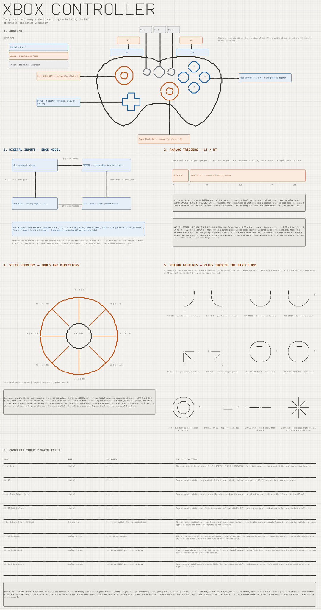](diagrams/xbox-controller-input-state-map.svg)

Source: [`xbox-controller-input-state-map.turtlepen.json`](diagrams/xbox-controller-input-state-map.turtlepen.json).
It validates with zero findings, and the committed SVG hashes identically to a fresh render
of that source.

### Real professional documentation

An HVAC condenser replacement field workflow: numbered stages, colour-coded hold points
that gate progress, photo capture references, and a safety banner. This is the case the
project exists for — a document someone has to follow correctly on a roof.

[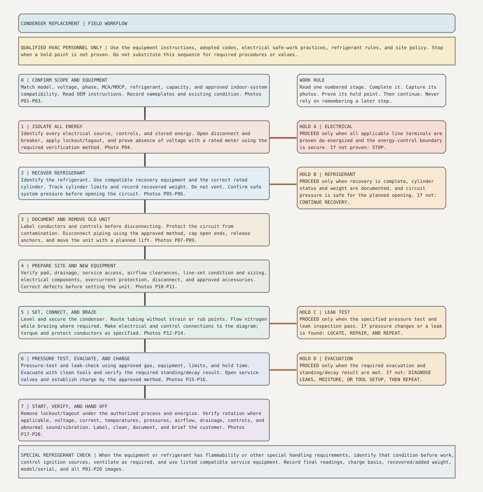](diagrams/condenser-replacement-field-guide.svg)

### Data visualisation

BTC/USD hourly candles with wicks, a moving average, and a volume histogram — every
element on the same integer lattice as everything else.

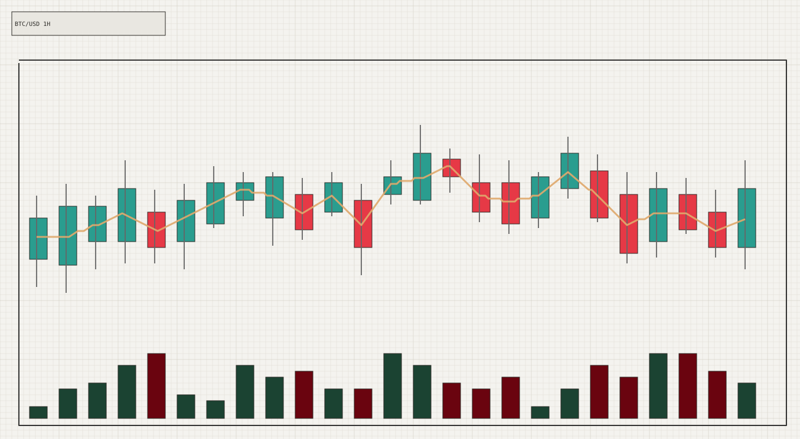

### Illustration — the postcard series

Five full-bleed scenes in one frame size, built from filled regions on the integer lattice.
There is no raster layer in any of them: the graded skies, the layered ridgelines, the
flame, the moon's shadowed disc and the submarine's portholes are all lattice geometry.

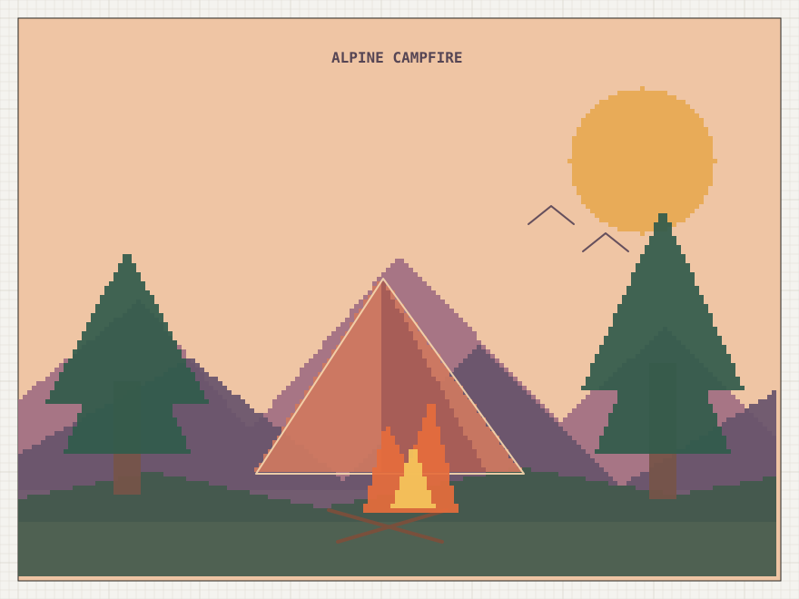

| | |
|---|---|
| 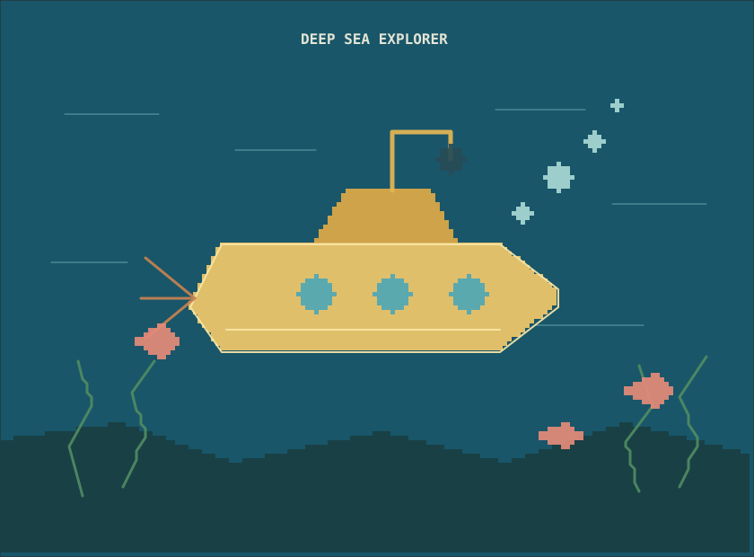 | 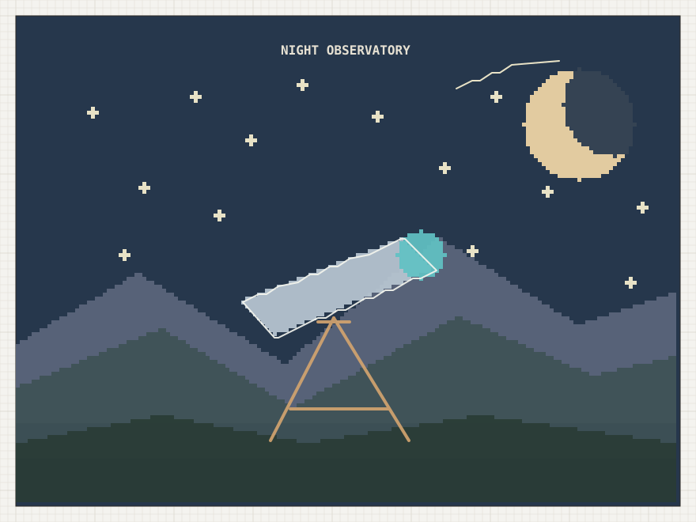 |
| 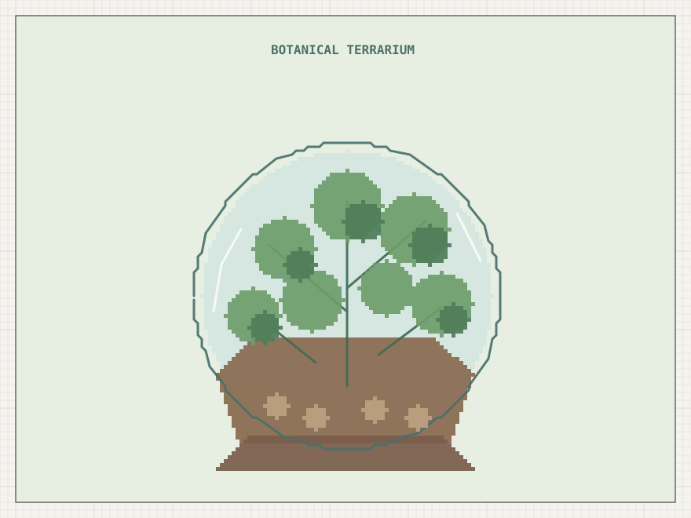 | 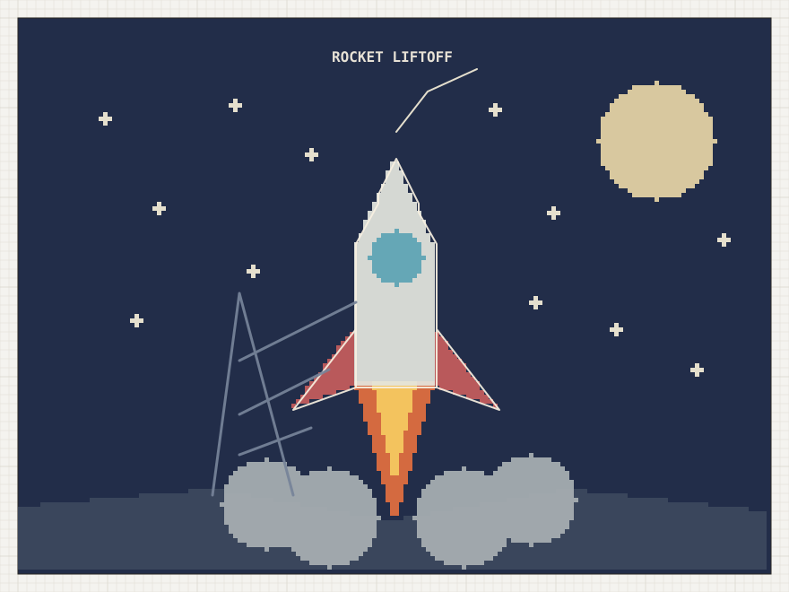 |

And a weathered picket fence, for texture rather than colour: grain, nail heads, two rails,
and a vine crossing *in front* of them on a separate Z-page.

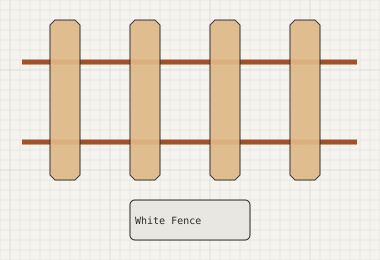

### Flowcharts with real symbols

Decisions are diamonds, terminators are stadiums, and the distinction is load-bearing —
each shape carves its own label aperture out of its bounding box. Lanes are containers:
they reserve only a title band and a border ring, so members sit inside without colliding
with them, and a connector can cross from one lane to another.

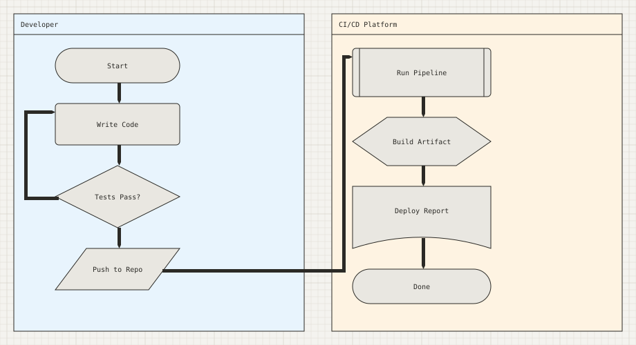

Synchronisation bars fan several sources into one stage and back out again, with solid and
dotted edges carrying different meanings.

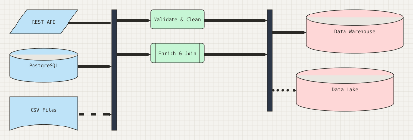

### The two atlases — what the lattice can draw

Every node shape, corner style, connector pattern, cap and arrowhead:

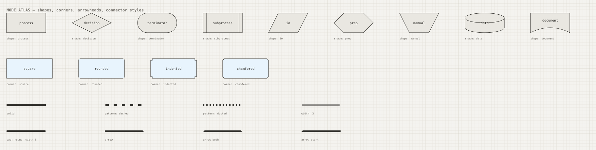

Every mark primitive, with tone, feather, texture and arc angles:

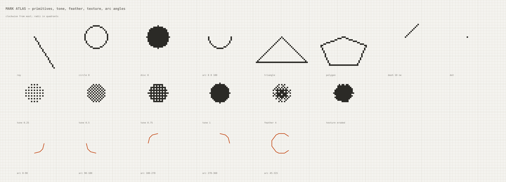

### TurtleFont — a stroke typeface on the same lattice

441 glyphs drawn as pen strokes rather than imported as outlines: Latin with accents and
Central European, Greek, Cyrillic, arrows, mathematics and marks, plus a size ramp that
labels each step `exact` or `rounded` and a weight ramp from pen 1 to pen 4.

Text stops being a foreign object on the grid. `measureStrokeText` **is**
`renderStrokeText` with the quadrants discarded — one implementation, so measurement and
rendering cannot drift apart.

[](diagrams/turtlefont-specimen.svg)

### Tracing a source image, measured rather than asserted

Five seeded-random trials, each showing the source against a direct 1× trace and a 4×
box-averaged working canvas resampled back down — with ink coverage, edge coverage and
partial-cell counts reported per case. The claim that supersampling helps is a number here,
not an adjective.

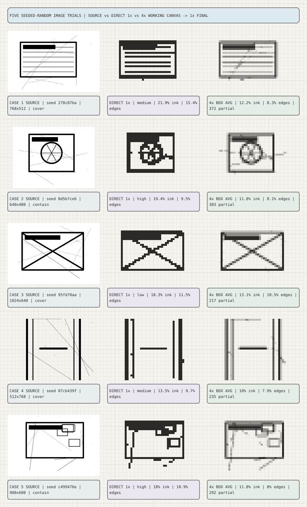

### Five farm animals, with the working record

Five closed outlines drawn as pen programs. Kept because the record behind the picture is
the more interesting artifact: every measurement, finding and adjudication that produced
them is published in [the 14-page PDF](docs/turtlepen-five-farm-animals.pdf).

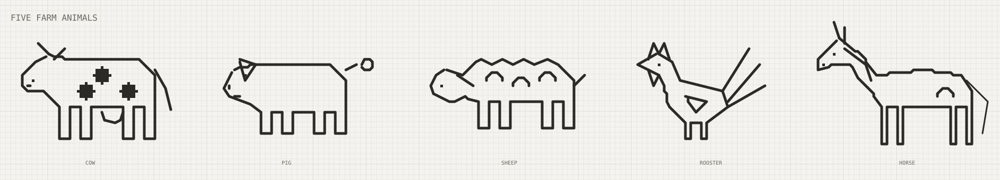

More — the swimlane flowchart, the perceptual-review study, the wireframe, the depth
scene, and the logo drawing itself — is further down this file.

## The problem it solves

Every mainstream diagram tool measures text at *render* time — inside the
browser or renderer, long after the author has already chosen the box size and
committed. A human catches the overflow instantly by eye. An AI has no eye, so
it produces sloppy output: text that doesn't fit its box, lines that cross
shapes, layers that collide, and nothing anywhere that says so.

TurtlePen inverts that. Measurement happens **before** placement, every
coordinate is an integer, and every defect is reported with a severity and a
numeric fix. Nothing is ever silently resized — the engine measures and reports,
and the AI decides.

## The lattice

```
1 cell  = 10 x 10 px          1 quadrant = 5 x 5 px          strokes = 5px thick
┌────┬────┐
│ q1 │ q2 │   Every legal position is a whole number of quadrants, so results
├────┼────┤   are byte-identical across runs. A collision report is a fact,
│ q3 │ q4 │   not an approximation, and tests assert exact cell sets.
└────┴────┘
```

Addressing is Excel's: columns `A…Z, AA…`, rows `1, 2, 3…`, origin `A1`
top-left, unbounded right and down. There is no negative addressing, so every
address parses unambiguously — start at an inset origin such as `T20` if a
drawing may need to grow up or left.

Three precisions are accepted anywhere a location is expected:

| Form | Meaning | Size |
|---|---|---|
| `C4` | whole cell | 10 × 10 px |
| `C4.tl` | pin point — 9 per cell (`tl t tr l c r bl b br`) | lattice point |
| `C4.q2` | quadrant — 4 per cell | 5 × 5 px |

## The pen

The AI walks a cursor around the lattice laying down strokes and junction
pieces, rather than declaring endpoints and hoping a router does something sane.
Every stroke has an explicit author and an exact footprint, so a collision can
name the step that caused it.

```
pen J8.q1                              # place the cursor
down 2 align right line                # 2 cells of 5px stroke, hugging the right half
down corner align top right            # arrives from the top, leaves to the right
right 3 align top line
right corner align left bottom         # arrives from the left, leaves downward
down align left line to queue.N arrow  # engine counts the distance; run ends in an arrowhead
```

- **Distances count whole 10px cells.** Strokes are 5px, so `align` picks which
  half of the cell they hug: `left|right` for vertical, `top|bottom` for
  horizontal. There is deliberately no `center` — a 5px stroke centred in a 10px
  cell would start at 2.5px, off the lattice.
- **Locations may appear on any command** (`at C7.q2`, or bare `(C7.q2)`), so
  relative walking and absolute re-anchoring mix freely. An error stays
  contained to the run between two absolute locations.
- **`to <address>` or `to <id>.<port>`** draws until it reaches a target and
  reports the distance travelled, so the AI never has to count cells to a box
  whose size came from measured text.
- **Indexed cardinal ports fan out competing connectors.** `gateway.S#1` is
  the existing midpoint, `S#2` is one cell left, `S#3` one cell right, then the
  sequence alternates outward by whole cells. The same syntax works on targets
  (`to worker.N#2`). `place_box` and `describe` report each face's slot capacity;
  an out-of-range slot is rejected rather than clamped onto another track.
- **A corner names the two sides it connects**, one of which must be the side
  the path arrives on. Styles: `square rounded indented chamfered`.
- **`arrow` on a `line` command turns the run's last quadrant into the
  arrowhead**, rather than adding one after it — so `line to db.W arrow` points
  at a box without overlapping it. Standing alone, `<dir> arrow` places a head
  at the cursor.
- **`curve <addr> <addr> <addr> …` draws a smooth line through its points.**
  `ray` is straight and `arc` is circular; a curve is neither, and hair, drapery
  and coastlines are all curves. Sampled Catmull-Rom, then connected with rays,
  so the run is contiguous by construction rather than by a lucky sample rate.
- **`ellipse <rx> <ry> [rotDeg]` finishes the circle family.** With equal radii
  and no rotation it delegates to `circle`, so the two commands can never
  disagree about the same shape.
- **`fill` turns a closed outline into a region that CLAIMS its interior.** That
  is the point, not a side effect: a filled shape genuinely occupies its inside,
  so it hides what is behind it and the collision engine knows. `fillColor`
  colours the region independently of the outline, and given `{ from, to }` it
  gradates ACROSS the region — tone, without hatching. An open outline is
  refused rather than flooded: a shape that silently fills the page is much
  worse than one that fills nothing.
- **A stroke may change colour along its own length.** `color: { from, to }`
  spreads a ramp over the pieces. Colour lives on the piece, not the element —
  it never reached the collision engine, so where it was stored was only ever a
  presentation decision.
- **`stroke_text` draws words as INK.** Text used to be the one mark that escaped
  the lattice: a label was an SVG `<text>` run, rendered by whatever font the
  viewer had, and `core/text.js` had to PREDICT its width rather than know it.
  TurtleFont is a stroke face of 442 glyphs — Latin with accents, Greek,
  Cyrillic, maths, arrows, currency and marks — drawn as integer polylines on
  the quadrant grid. The words collide like any other stroke, measure exactly,
  and survive without a font file. It is honestly a DISPLAY face: cap height is
  12 quadrants (60px). The first version used 6, and five rows of x-height was
  too few to draw a lowercase letter properly — that one constraint was behind a
  pinched `a`, an `s` that read as an `8`, and fractions that could not be read
  at all, and it scales by whole multiples only, since
  there is no half quadrant to interpolate onto. A character the face cannot
  draw is refused rather than skipped — a missing glyph must never become a
  silent hole in a sentence. `font_coverage` says what it has.
- **`stroke_label` inks a box's label, so a whole drawing can be font-free.**
  `place_box` writes its label as `<text>`, which is right at body sizes and
  impossible to plot; this draws it with TurtleFont instead, centred in the room
  the SYMBOL leaves rather than the bounding box. The label is its own element,
  so it collides on its own terms — and the rule about strokes crossing nodes
  exempts a label from the one box it names, which the author states, never
  something inferred from proximity. `examples/inked-diagram.js` renders a
  diagram containing zero `<text>` elements and checks that claim rather than
  making it.
- **Ask for a size, not a multiple.** `size` is the cap height in quadrants —
  6 is 30px, 12 is what the glyphs are drawn at, and every whole number between
  and above works. A whole multiple of the design size reproduces the drawing
  exactly; anything else rounds glyph points onto the lattice, and the result
  SAYS which happened rather than leaving you to wonder. The floor is measured,
  not chosen: `pnpm run font:floor` renders all 442 glyphs at each candidate
  size and finds where two letters start landing on the same quadrants. Below
  that it refuses, because an unreadable letter is the same hole in a sentence
  that a missing one would be.
- **`weight` is a separate axis.** Pen thickness in quadrants, independent of
  size, so one size can be light or bold — and a plotter with a single nib can
  draw a large size with a one-quadrant pen.
- **Text turns in quarters.** `rotate: 90` gives a vertical axis label that
  loses nothing: on a square lattice a quarter turn maps every quadrant onto
  another quadrant exactly. Any other angle is refused, because it would need
  coordinates between quadrants.
- **`glyph` shows one letter's ink and fingerprints it.** Two different stroke
  lists can rasterise to identical quadrants — this repo shipped a "redrawn"
  letter that changed nothing before that was noticed — so a source change is
  not proof of a drawing change. The fingerprint is what tells them apart, and
  the picture reads in a terminal so a glyph can be judged without rendering an
  SVG.
- **`layout` chooses the arrangement; `align` and `distribute` tidy one you
  already chose.** It ranks the graph so flow runs down the page, gives every
  long edge a lane of its own, reorders each rank to remove crossings, centres
  each node over its neighbours, spreads fan-out across indexed port slots, and
  redraws the connectors — including a loop back up the outside margin, which
  every real flowchart has. The graph is authored fact: `pen from a.S` states an
  origin and `line to b.N` states a target, so nothing is inferred from which
  boxes happen to sit near each other. It reports what moved, how many crossings
  went away, any cycle it reversed to rank the graph, and any connector it could
  NOT redraw — a route that cannot be made is reported, never faked.
- **`align` and `distribute` do the smaller layout arithmetic.** Every diagram in this
  repo used to hand-write a gap constant, a running row counter and a uniform
  width worked out with `Math.max`; that is what makes a generated diagram look
  generated. Neither invents a position — the target comes from the elements you
  name, and anything unnamed is left alone.
- **Paper is document state.** `set_background <hex>` colours the sheet, and it
  is saved with the drawing — a composition made against dark paper is a
  different composition, and re-rendering it light would misreport it.
- **A box fill is a hex OR a gradient.** `fill: { from, to, angle }` emits a
  linear gradient keyed to the box. Both are presentation: no fill of any kind
  reaches the collision engine.
- **`arrow both` heads each end; `arrow start` heads only the origin.** The head
  at the origin points back the way the run came, because a double-headed arrow
  points outward at both ends. The run itself is unchanged — no quadrant is
  added or moved, the first and last simply become heads. A run one quadrant
  long has one end and is refused.
- **A port belongs to the shape, not to its bounding box.** `pen from x.E` and
  `line to x.W` both seat against the quadrant the SYMBOL actually inks, so a
  connector meets a diamond at its vertex and a parallelogram at its slant. The
  span between the ink and the claimed rectangle is claimed-but-uninked, which
  the engine reports as information exactly like a corner cut.
- **An omitted `align` continues on the track the cursor is already on.** A
  fixed default would fight a deliberately seated cursor.

## Shapes: anything that is not a rectangle

The lattice is orthogonal, so a diagonal, a circle and an arc are the same kind
of thing — a computed set of whole quadrants. These are the classic integer
algorithms, chosen for the reason they were invented and the reason this project
exists: they are exact.

**They are starting points, not results.** A single `circle` is one gesture; a
composition is what you build from several, related by anchors and varied
deliberately. `validate` now says so out loud — `C001` reports a document whose
densest page has too little ink to have been composed at all.

The worked example to measure against is `diagrams/art-deco-hero.svg`, drawn
entirely on these primitives and inking 11% of its canvas. A page that reaches
for one primitive and stops will typically ink under 1%.

```
ray to AF20.q1        a straight line at ANY angle (Bresenham)
curve C4 K10 S6 AB14  a smooth line through the points, contiguous by construction
circle 12             outline (midpoint); radius in QUADRANTS, not cells
ellipse 24 10 30      the same family, two radii and an optional rotation
circle 18 fill        any closed shape may be filled; the region claims its inside
disc 12               the same circle, filled
arc 12 0 90           part of it, clockwise from east
triangle M4.q1 T9.q1  three points; polygon takes more
dash 6 se             six quadrants diagonally — the morse dash
dot                   one quadrant — the morse dot
```

`dir8` is `n ne e se s sw w nw`, and `up/down/left/right` still work. A stepped
diagonal is not an approximation of a smooth line; on a lattice it **is** the
line, which is how interface art was drawn on 1-bit displays.

## Anchors and durable relationships

Connectors got `pen from <id>.<face>` early, because a hand-computed address is
where the mistakes live. Shapes did not, so every part of the first logo was an
absolute coordinate and the proportions drifted. An anchor fixes that during
authorship: the relationship is resolved from the target's current footprint
when the program runs, instead of being recomputed by the author.

```
pen at shell.C                       put the cursor ON an element
circle 15 at shell.N                 anchor a shape to one
circle 7 at head.W offset -3 4       nudge in whole quadrants
```

`from` gives the **seat**, one step *outside* the element, where a connector
starts. `at` gives the **anchor**, on the element, where a shape belongs.
Anchors are `N NE E SE S SW W NW C`, and work on anything with a footprint —
including a drawn path, whose footprint is computed from the quadrants it covers.

Placement anchors remain declarative inputs: rerunning the same program after
changing `shell` recomputes a placement. For an existing element that must keep
following another, store an explicit relationship instead:

```json
{ "action": "create", "id": "label-follows-unit",
  "dependent": "label", "target": "unit",
  "dependentAnchor": "W", "targetAnchor": "E",
  "offsetX": 2, "offsetY": 0 }
```

`constraint` supports `list`, `create`, `delete`, and `sync`. A dependent has one
parent; chains cascade, cycles are refused, offsets are exact quadrants, and
relationships survive save/open. Moving, resizing, or redrawing a target moves
its dependents. Manually moving a dependent authors a new offset. `describe`
reports both sides and whether stored and actual offsets are synchronized.

### Semantic node relationships

`connect` makes an edge a model fact as well as exact ink. It starts and ends
at named node ports and records routing, description, technology, tags,
properties, and perspectives:

```json
{ "id": "api-to-db", "from": "api.E", "to": "db.W",
  "routing": "curved", "via": ["K5.q1"],
  "description": "queries customer records", "technology": "SQL/TCP" }
```

`direct` is one exact ray, `orthogonal` uses the inspectable simple router, and
`curved` rasterizes through explicit lattice waypoints. A curve with no waypoint
is refused instead of inventing a design decision. `annotate` adds model fields
to existing elements; `inspect_model` independently reports semantic omissions,
disconnected nodes, and broken relationship references.

### Reversible 1px eraser

`micro_mask` is a presentation-only eraser for artwork paths and images. One
design pixel means one integer pixel in the canonical SVG coordinate system:

```json
{ "action": "add", "id": "cleanup-1", "target": "ink",
  "points": [{ "x": 25, "y": 70 }], "width": 1 }
```

It changes SVG and `renderHash`, but never cuts the target's 5px quadrant
footprint. Save/open, plan, history, viewer restore, and target movement preserve
the mask. Remove it with `micro_mask { "action": "remove", "id": "cleanup-1" }`.

> **Corner anchors are bounding-box corners.** On a rectangle that is what you
> want. On an ellipse or any organic shape, `SW` is the corner of the box around
> it, which is empty space — anchoring feet there puts them off the body. Use
> the edge midpoints (`N S E W C`) with an offset for anything not rectangular.

## Tracing over a reference

```
place_reference { source: "ref.png", span: "40x24" }
… draw over it …
remove_page { id: "reference" }
```

The image is dithered onto the lattice — so it is made of the same quadrants you
will draw in — put on a page below the base at 0.25 opacity, and flagged. `L020`
reports it until you remove it, because scaffolding that ships is worse than no
scaffolding.

**Closed shapes are not connectors.** A path that returns to its start is marked
`closed`, and the rules about dangling ends and retraced quadrants do not apply
to it — they are about connectors, and applying them to an outline is how a rule
cries wolf.

**Open artwork is not a connector either.** Set `role: "artwork"` on `pen` (or
inside `plan`) to draw branches, contours, and other intentionally open marks
without connector-only `L008`/`L015` findings. Artwork may also declare a hex
`color`, a `width` from 1–5px, and `cap: "butt"|"round"|"square"`. Those are
presentation properties: the collision engine still claims the exact integer
quadrants, while the SVG paints a simplified continuous line through them.
Set `paint: "cells"` to colour every claimed quadrant instead; this is how the
canonical logo builds solid forms without embedding a bitmap or weakening
collision geometry.

- **`hop` marks a deliberate crossing.** It renders as a bridge arc and exempts
  that quadrant from the stroke-overlap rule, so an intended crossing is not
  reported as a defect. It still claims its quadrant, so a hop through a box is
  still an error.

## Connectors: the two mistakes worth knowing

Both of these came out of an actual authoring session, not from theory. The
first run of `examples/agent-session.js` produced four broken connectors from
entirely reasonable-looking code.

**1. Don't compute the start address yourself.** A box's south face is already
outside it, but its north face *is* the box's own top row — so leaving northward
starts one quadrant higher. Getting this wrong puts a one-quadrant gap between
the connector and the box, which reads as a dangling end. Use the seat instead:

```
pen from gateway.S          # seated just outside, already facing down
down line to checkout.N arrow
```

When several paths leave that face, index the seats instead of merging their
first run:

```
pen from gateway.S#2        # one full cell left of the midpoint track
down line to worker.N#2 arrow
```

`place_box` and `describe` report the default seat address and slot capacity for
every face, so neither the coordinate nor the valid index range has to be
derived.

**2. `to <id>.<port>` sets a distance, not a destination.** It measures along
the direction of travel only. A run on the wrong row or column stops *level
with* its target and never touches it. That is legitimate on an intermediate leg
— "go right until level with it, then turn" — so it is checked against the
finished path, and reported as `L016` with the gap quantified if the path never
arrives.

## Corner styles participate in collision

A rounded, chamfered, or indented box does not visually occupy its four corner
quadrants, so its **claimed** footprint is larger than its **visual** one. A
stroke through an indented corner is reported as information (`L013`), not as an
error (`L004`). Without that distinction the engine would flag collisions a
human eye would not see — which trains an AI to ignore the log.

## Z-pages

Overlapping is a mistake on one layer and the entire point on another, and
geometry alone cannot tell which. So each page declares its intent:

| Intent | Overlap with lower pages |
|---|---|
| `exclusive` | `L005` **error** — nothing below may be overlapped |
| `overlay` | `L010` **information** — expected, so annotation layers stay quiet |

Within a single page, overlap is always an error regardless of intent.

## Collision rules

| Rule | Sev | What it catches |
|---|---|---|
| `L001` | S0 critical | two elements claim the same quadrants on one page |
| `L012` | S0 critical | duplicate element id — targets become ambiguous |
| `L002` | S1 error | measured text wider than the box interior |
| `L003` | S1 error | wrapped text needs more lines than the box shows |
| `L004` | S1 error | a path runs through the inked body of a box |
| `L005` | S1 error | an exclusive page overlaps content below it |
| `L021` | S1 error | opaque overlay content obscures a lower text run |
| `L006` | S2 warn | two paths share a quadrant with no junction or hop |
| `L007` | S2 warn | two boxes touch with no separating quadrant |
| `L008` | S2 warn | a path ends without meeting a box or another path (one finding per path, not per end) |
| `L009` | S2 warn | font size below the 8px legibility floor |
| `L011` | S2 warn | an element extends past the declared canvas |
| `L014` | S2 warn | a stroke drawn on a track the cursor was not on |
| `L015` | S2 warn | a path re-draws a quadrant it already covered |
| `L016` | S2 warn | a path named a destination but stops short of touching it |
| `L020` | S2 warn | a temporary tracing-reference page is still present |
| `L022` | S2 warn | a rasterized image has enough neighboring ink changes to obscure its identity |
| `L023` | S2 warn | continuous-tone source was simplified without semantic understanding |
| `L024` | S2 warn | a shape is stretched until its silhouette no longer distinguishes it |
| `L025` | S1 error | things at different depths share a page, so neither can pass behind the other |
| `L010` | S3 info | expected overlap from an overlay page |
| `L013` | S3 info | a path crosses a claimed but un-inked corner cut |
| `C001` | S3 info | sparse canvas — too little ink to have been composed; compose it, or declare the page `schematic` |

## The workflow

**measure → plan → commit → adjudicate → render → look.**

`plan` is the centre of it: send the whole composition as a batch of operations
and read the collision log *before* anything is written. The document is
untouched until the same batch is re-sent with `commit: true`, and a batch that
fails part-way applies nothing at all — a half-applied composition would leave
the document in a state nobody asked for.

`free_space` searches the whole non-reference page stack by default, including
hidden pages because they are still validated. Its response names the effective
`scope`, target, and every page searched. Use `scope: "page"` only when overlap
with other pages is intentional; tracing references are excluded because their
declared purpose is to be drawn over. `cellsW` and `cellsH` must be supplied
together, so an incomplete fit query cannot silently turn into list mode.

`describe { region: "C4:AZ40" }` keeps large-document reads bounded. Boxes,
text, and images intersect by their claimed rectangles; paths are checked piece
by piece, so an empty area inside an L-shaped path's bounding box is not returned.
The response preserves the normal per-page array and includes the normalized
effective filter. Combine `page` and `region` to narrow both dimensions.

`history` is the recovery path for a committed edit that proves wrong. It keeps
the newest 100 successful mutations by default (configurable from 1–1000 with
`TURTLEPEN_HISTORY_LIMIT`); failed and no-op calls consume no entry, and a
divergent edit after undo clears redo. Undo, redo, and `clear` update a versioned
`<diagram>.history.json` sidecar immediately. The sidecar is bound to the exact
document hash, so history survives open and MCP restart while an outside edit
invalidates stale recovery instead of applying it to the wrong state.
Composition source is part of the document: reopening a wireframe still
supports `export_prompt`, and perspective inputs remain available as provenance.
`export_prompt` first checks the generated boxes and routed paths against the
live document. If later editing made the source stale, it names the first stale
element and refuses to emit an obsolete layout; undo the edit or rerun
`wireframe` to establish a new source.

```
plan  { operations: [ …place boxes, run pen programs… ] }
  → rehearsed 6 operation(s) on a copy — the document is unchanged.
    [ERROR] L002 "audit" label needs 48px but the interior is 50px …
            fix: widen box to 7 cells

…adjust the plan, not the document, then…

plan  { operations: […], commit: true }
  → committed 6 operation(s).  status: PASS
```

Placement is never blocked for collision, so sketching roughly and repairing
afterwards works too — the AI is not fighting per-call rejections either way.

Adjudication is where intent is declared. `accept_finding` records a finding as
deliberate, keyed to a fingerprint derived from the rule, page, actors and exact
quadrants. If the geometry later changes, the fingerprint changes with it and
the acceptance lapses automatically — so "I meant that" can never quietly
suppress a genuinely new problem.

## Every fix has a tool

The collision engine only suggests repairs it can actually perform. A diagnostic
vocabulary that outgrows the action vocabulary strands the AI in a loop it
cannot exit, so these are kept a closed set — and a test asserts it.

| Fix kind | Tool |
|---|---|
| `widen`, `heighten` | `resize` |
| `shorten`, `font` | `restyle` |
| `move` | `move` |
| `rename` | `rename` |
| `intent` | `update_page` |
| `canvas` | `set_canvas` |
| `extend` | `extend_path` |
| `reroute`, `offset`, `hop` | `replace_path` |
| `remove` | `remove` or `remove_page` according to target kind |

## Running it

```bash
pnpm run check                         # full test suite + examples, logo, and tree
pnpm test                              # automated test suite
pnpm run test:endpoints                # MCP, HTTP, and WebSocket surface contract
pnpm run quality:manifest              # regenerate role-scoped artifact evidence
pnpm run governance                    # source checkout: enforce naming, catalog, SSOT, and generated-file parity
node src/cli.js render diagrams/example.turtlepen.json --format svg --json --force
node src/cli.js review diagrams/example.turtlepen.json --render-hash <hash> --reviewer <name>
node examples/build-example.js         # the plan -> commit cycle, end to end
node examples/agent-session.js         # an agent authoring a real diagram over MCP
node examples/constraint-stress.js      # crowded same-face rehearsal and rework over MCP
node examples/rework-session.js         # commit, detect, undo, redo, reopen over MCP
pnpm run field-guide                    # build the condenser replacement field workflow over MCP
pnpm run image-session                  # exercise embed, dither, simplify, and review/reference gates over MCP
pnpm run random-images                  # compare direct 1x and 4x->1x simplify across five seeded-random sources
pnpm run logo                          # regenerate the canonical 1200x1200 logo
pnpm run tree                          # regenerate the 540x960 branching-tree study
node src/viewer/server.js --doc diagrams/example.turtlepen.json
node src/mcp/server.js                 # MCP over stdio
TURTLEPEN_HTTP_BEARER_TOKEN=<secret> pnpm run mcp:http  # stateful MCP over HTTP
```

Register the MCP server with any MCP-aware agent. Use the absolute path to your
own clone — `args` is resolved by the agent, not by a shell, so `~` and relative
paths do not expand:

```json
{ "mcpServers": { "turtlepen": {
    "command": "node",
    "args": ["/absolute/path/to/turtlepen/src/mcp/server.js"]
} } }
```

There is nothing to install first: no runtime dependencies, Node 20 or newer.
Clone it, point the config at `src/mcp/server.js`, and run `pnpm test` once to
confirm the clone is sound.

For remote clients, `src/mcp/http-server.js` exposes the same live registry and
one active document per `Mcp-Session-Id` over MCP Streamable HTTP. Its default
bearer-token boundary is for a private preview; a public multi-user endpoint
still needs TLS, OAuth identity, per-user quotas, and an authenticated file
bridge. See the [remote MCP transport contract](docs/remote-mcp.md), including
the required dual `Accept` header and Cloudflare user-agent gotcha.

74 tools. Call `turtlepen_help` first for a compact orientation, use
`search_help { query }` for task-focused discovery, and request
`turtlepen_help { section: "all" }` for the complete grammar and rule manual.

The maintained [endpoint and use-case coverage matrix](docs/endpoint-use-case-coverage.md)
maps every transport, tool, viewer route, and known workflow to executable evidence.

The project also ships a practical work product authored through the real MCP
transport: [Condenser replacement field workflow](diagrams/condenser-replacement-field-guide.svg)
([editable JSON](diagrams/condenser-replacement-field-guide.turtlepen.json)). Its
P01-P20 references map to a reviewable
[LLM photo-shot list](docs/condenser-replacement-photo-shot-list.md) rather than
uncontrolled web imagery.

The [real-image MCP exercise](diagrams/condenser-image-workflow.svg) embeds a
generated 1536 x 1024 condenser photo as evidence and uses a separate generated
line-art derivative for tonal dither, non-fidelity simplify, and the temporary
reference gate. Simplify may use a bounded 4x-linear working canvas and
box-average each 4x4 block into weighted final-quadrant coverage, preserving
fine connected structure and smoother edges without claiming new source detail.
The workflow reports every
up/downscale stage, blocks checkerboard output through `L022`, and blocks
semantically unverified continuous-tone approximations through `L023`. Prompts,
hashes, metrics, and usage boundaries are recorded in
[the image workflow test](docs/image-workflow-test.md); the operational contract
is [the image scaling procedure](docs/image-scaling-procedure.md).

The [five-case random contact sheet](diagrams/supersample-random-five.svg)
repeats the supersampling path across seeded RGB/RGBA, portrait/landscape,
contain/cover, and low/medium/high-detail sources. All five cases preserve the
same final `48x32`-quadrant geometry, preserve partial coverage through
save/reopen/render over real MCP, reduce weighted edge transitions without
inflating effective ink, and record source plus run hashes in the
[evidence ledger](docs/supersample-random-five-report.md).

| Group | Tools |
|---|---|
| orient | `turtlepen_help` `search_help` `doctor` `runtime_info` `describe` `ascii` `free_space` `history` |
| author | `new_diagram` `open_diagram` `add_page` `remove_page` `measure` `place_box` `pen` `connect` `annotate` `plan` `group` `constraint` `import_mermaid` `route` |
| workspace | `define_view` `remove_view` `configure_theme` `attach_resource` `remove_resource` |
| check | `validate` `inspect_model` `accept_model_finding` `unaccept_model_finding` `perceptual_review` `release_check` `accept_finding` `unaccept_finding` |
| layout | `align` `distribute` `layout` |
| repair | `repair` `resize` `restyle` `move` `rename` `update_page` `set_canvas` `extend_path` `replace_path` `remove` |
| fidelity | `micro_mask` `stroke_text` `stroke_label` `glyph` `font_coverage` `set_background` |
| lattice editing | `boolean` `slice` `offset_path` `stroke_to_path` `path_edit` `normalize_path` `reorder` `duplicate` `array` |
| inspect geometry | `inspect` |
| SVG import | `inspect_svg` `import_svg` |
| compose | `wireframe` `perspective_scene` `export_prompt` |
| image | `measure_image` `place_image` `place_reference` |
| output | `render` `save` |

## Seeing the drawing

`ascii` renders the lattice as text at quadrant resolution — two characters per
cell, real Excel headers, collisions marked — which is how an AI reads its own
drawing back:

```
     B C D E F G H I J K L M N O P Q R S T U V W
   4 ··aAAAAAAAAAAAAAAAAAAAAAAAAAAa··············
     ··AAAAAAAAAAAAAAAAAAAAAAAAAAAA··············
   8 ·················│··························
  10 ·················└──────┐···················
  12 ··bBBBBBBBBBBBBBBBBBBBBBBBBBBb··········cCCc
```

Lowercase marks a claimed-but-not-inked corner cut. `✗` marks a collision.

## Architecture

```
src/core/     pure engine, no I/O — geometry, address, text, shapes,
              document, pen, edit, svg-import, occupancy, collide, ascii, svg
src/mcp/      shared MCP protocol/runtime, stdio and Streamable HTTP transports,
              and the canonical tool definitions
src/viewer/   local HTTP/WebSocket server + live browser editor and log
src/quality/  artifact catalog, manifest, and naming/SSOT governance
test/         node:test, no framework
examples/     worked end-to-end demonstration
```

Every mutating capability is a named entry in `core.OPERATIONS`, which is what
makes `plan` possible: the same operations run against a throwaway clone or the
live document, so the batch surface and the tool surface cannot drift apart.

The core is pure and shares one code path with both the MCP server and the SVG
renderer, which is what makes measurement and rendering physically unable to
disagree. Every text run is emitted with `textLength`, obliging the browser to
fit glyphs into exactly the width the engine measured.

## Seeing it as a human

`node src/viewer/server.js` serves a local live editor at `127.0.0.1:8791`.
WebSocket state replaces browser polling. Select SVG elements by pointer or
keyboard, then move, resize, restyle, extend/replace paths, manage flat groups
and follow relationships, accept or withdraw findings, delete, undo, or redo.
The log keeps open, accepted, and stale acceptance states visible; only a
currently reported fingerprint can be accepted. Fit/zoom and
page visibility remain browser-owned view state; the document, validation log,
and durable history remain server-owned. A file watcher broadcasts outside
edits, and a focused unsubmitted inspector draft is retained and marked stale
rather than overwritten. The compatibility `/api/state` endpoint remains for
diagnostics. WebSocket upgrades are local-origin checked, client frames must be
masked and protocol-valid, messages are bounded, mutations are serialized, and
only the editor's explicit public assets and tool allowlist are reachable.

## Deferred, deliberately

- **Auto-fit** — the engine reports the shortfall and the fix; it does not resize.
- **Proportional fonts** — the monospace model makes capacity countable
  (`chars/line = floor((cells × 10 − 10) / 6)` at 10px), which is arithmetic an
  AI can do reliably.
- **Negative addressing** — the grid runs `A1` rightward and downward only.
  Start at an inset origin if a drawing may need to grow up or left.

## Experimental AI-generated studies

These studies are retained as comparative authoring evidence, not presented as
release-qualified artifacts. Their authoritative role and quality disposition
live in [`artifacts/artifact-catalog.json`](artifacts/artifact-catalog.json);
[`artifacts/manifest.json`](artifacts/manifest.json) is generated evidence.

Two model runs drew the same eight briefs — four architecture diagrams and four
illustrative scenes — so the outputs can be compared against each other and against the
engine's own findings.

The spread within a single run is the interesting part. Two results from the Gemini 3.1 set
are good enough to sit in the gallery above: the [candlestick
chart](diagrams/gemini31-technical-analysis.svg) and the [weathered picket
fence](diagrams/gemini31-scene-fence.svg). From the same run and the same tool surface, the
[CI/CD pipeline](diagrams/gemini31-workflow.svg) renders three coloured discs with their
labels floating loose below the lane. Both outcomes are kept: a substrate that only ever
shows its best output tells you nothing about what a model will actually do with it.

<details>
<summary><strong>Gemini 3.6 Flash (High)</strong> — 8 studies (<code>build-all-diagrams.js</code>)</summary>

- [Server structure — HA microservices](diagrams/server-structure-ha-microservices.svg) ([JSON](diagrams/server-structure-ha-microservices.turtlepen.json))
- [Teaching — adaptive mastery cycle](diagrams/teaching-mastery-learning-cycle.svg) ([JSON](diagrams/teaching-mastery-learning-cycle.turtlepen.json))
- [Technical analysis — quant signal & risk engine](diagrams/technical-analysis-quant-engine.svg) ([JSON](diagrams/technical-analysis-quant-engine.turtlepen.json))
- [Workflow — CI/CD deployment pipeline](diagrams/workflow-cicd-deployment-pipeline.svg) ([JSON](diagrams/workflow-cicd-deployment-pipeline.turtlepen.json))
- Scenes: [apple](diagrams/scene-apple.svg) · [tree](diagrams/scene-tree.svg) · [fence](diagrams/scene-fence.svg) · [living room](diagrams/scene-living-room-family.svg)

</details>

<details>
<summary><strong>Gemini 3.1 Pro (High)</strong> — 8 studies (<code>build-gemini-3-1-diagrams.js</code>)</summary>

- [Server structure — load balanced](diagrams/gemini31-server-structure.svg) ([JSON](diagrams/gemini31-server-structure.turtlepen.json))
- [Teaching — learning feedback loop](diagrams/gemini31-teaching-loop.svg) ([JSON](diagrams/gemini31-teaching-loop.turtlepen.json))
- [Technical analysis — algorithmic trading engine](diagrams/gemini31-technical-analysis.svg) ([JSON](diagrams/gemini31-technical-analysis.turtlepen.json))
- [Workflow — DevOps CI/CD pipeline](diagrams/gemini31-workflow.svg) ([JSON](diagrams/gemini31-workflow.turtlepen.json))
- Scenes: [apple](diagrams/gemini31-scene-apple.svg) · [tree](diagrams/gemini31-scene-tree.svg) · [fence](diagrams/gemini31-scene-fence.svg) · [living room](diagrams/gemini31-scene-living-room-family.svg)

</details>

---

The following were authored using TurtlePen MCP tools by **Claude Opus 5**:

### Flowcharts — real symbols, not rectangles with labels

The shown example is the [two-lane swimlane](diagrams/showcase-flowchart.svg) at the top of
this file. `build-flowchart.js` also produces
[`flowchart-important-process`](diagrams/flowchart-important-process.turtlepen.json), which
exercises the same symbols at length but is not a good advertisement for them.

Decisions are **diamonds**, terminators are **stadiums**, and that distinction is
load-bearing rather than cosmetic. A node still *claims* its bounding box — so
layout, gutters and `free_space` are unchanged — but only *inks* its symbol, so
a stroke clipping a diamond's empty corner is `L013` information while one
through its body stays an `L004` error.

The consequence that matters: **text is measured against the symbol, not the
box.** A diamond gives a label about half its bounding width. The same label in
the same span fits a rectangle and overflows the diamond, and the log says so —
which is the overflow bug this project exists to eliminate, extended to shapes.

```
place_box { id: "spelling", at: "AT53", span: "30x9",
            label: "Free of spelling and logic errors?", shape: "decision" }
```

Shapes: `process` `decision` `terminator` `subprocess` `io` `prep` `manual`
`data` `document` `bar` — plus two containers, `lane` and `group`.

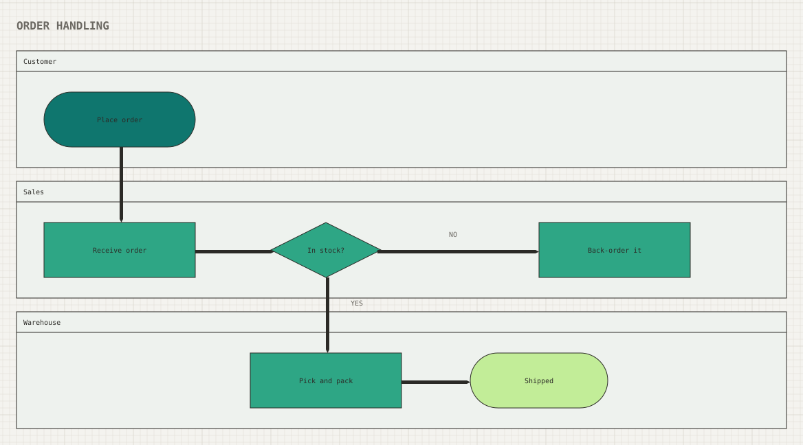

**Containers are the one exception to claiming.** A lane reserves only its title
band and border ring and leaves its hole free, so members placed inside collide
with nothing — while a node straddling the frame still reports `L001`, because
it really does cross the border. Flow crossing a lane boundary is a genuine
`L004` and is what `accept_finding` is for: handing over between lanes is what a
swimlane depicts, not a defect.

Building that exposed a latent bug worth naming: `L001` had been gating on
bounding-box overlap and only then computing the claimed intersection. For solid
boxes those are the same thing, so it had never mattered. It now tests the
claimed intersection itself.

Two of the standard drawing conventions are **checked rather than advised**, and
wake up on their own as soon as a document uses a decision or a terminator:

| | |
|---|---|
| `F001` | more than one terminator with nothing leading into it — a flowchart has one beginning |
| `F002` | a decision with fewer than two ways out — a judgement that does not branch is a process step wearing a diamond |

An edge is read from what the author stated (`pen from <id>.<face>` records the
source, `line to <id>.<port>` the target), never from which strokes happen to sit
near which box. Conventions that *would* require guessing — which floating label
belongs to which branch, whether a label is a verb phrase — are deliberately not
checked, because a rule that guesses teaches you to ignore the log.

The plan, the sources, and what was deliberately *not*
built are in [`docs/flowchart-support-todo.md`](docs/flowchart-support-todo.md).

### Five Farm Animals — with a full working record

*(Shown at the top of this file.)*

- **Composition**: [Five Farm Animals](diagrams/farm-animals.svg) ([JSON](diagrams/farm-animals.turtlepen.json))
- **Working record (PDF)**: [**TurtlePen — Five Farm Animals**](docs/turtlepen-five-farm-animals.pdf) · 14 pages

| | | |
|:--:|:--:|:--:|
| [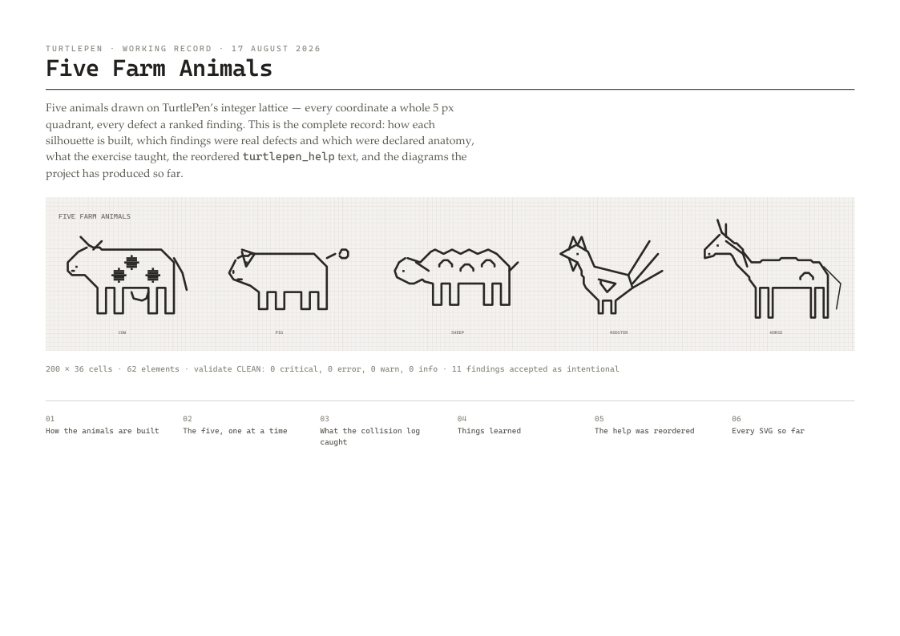](docs/turtlepen-five-farm-animals.pdf) | [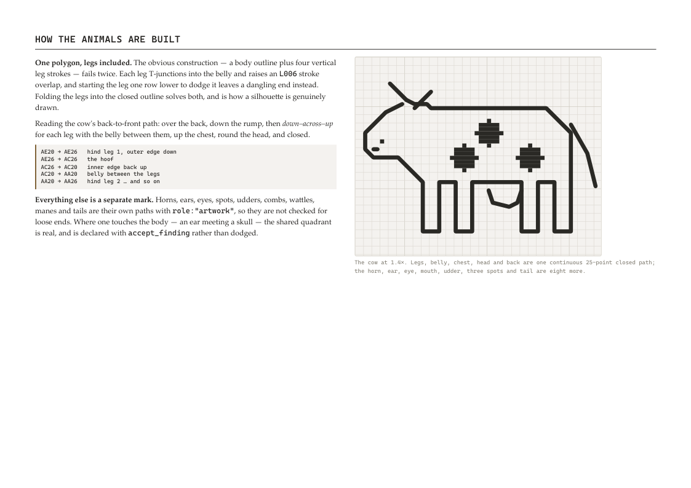](docs/turtlepen-five-farm-animals.pdf) | [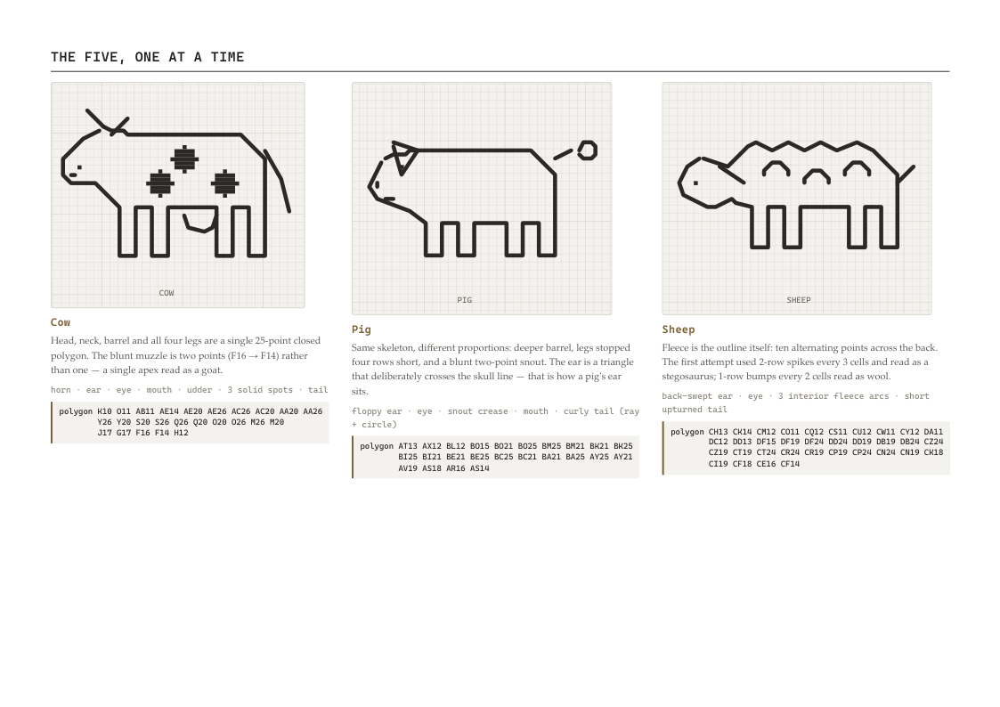](docs/turtlepen-five-farm-animals.pdf) |
| the composition | how each silhouette is built | every committed pen program |
| [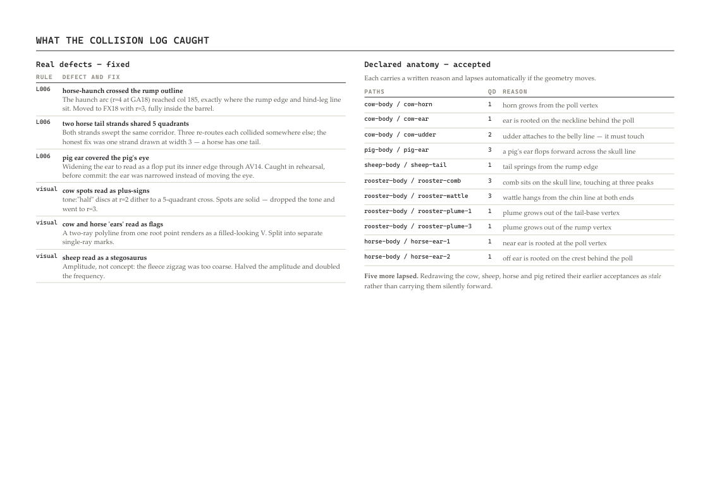](docs/turtlepen-five-farm-animals.pdf) | [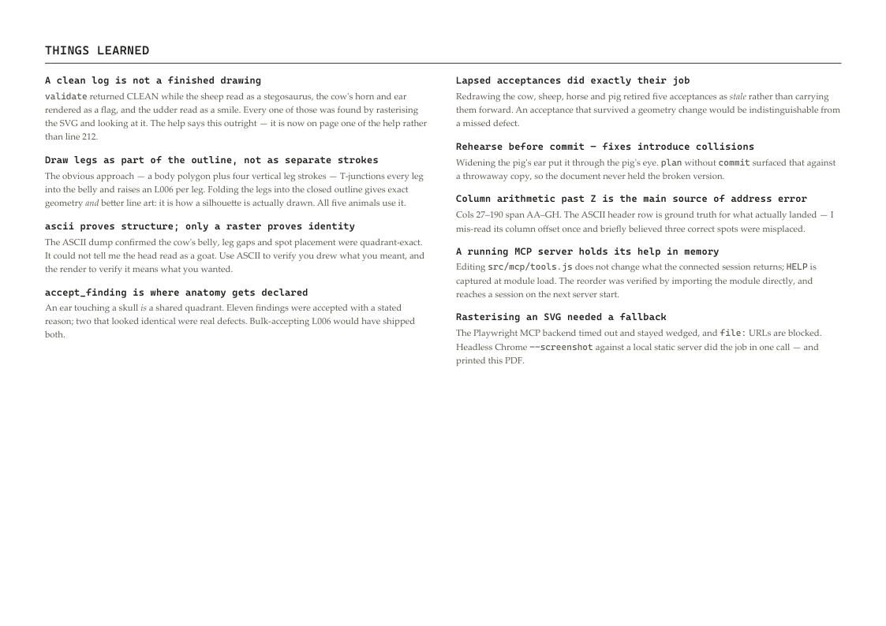](docs/turtlepen-five-farm-animals.pdf) | |
| real defects vs. declared anatomy | what the session taught | |

Cow, pig, sheep, rooster and horse each fold **head, body and all four legs into
a single closed polygon**. The obvious alternative — a body outline plus four
vertical leg strokes — T-junctions every leg into the belly and raises an `L006`
per leg; folding them into the outline gives exact geometry *and* better line
art, because that is how a silhouette is genuinely drawn.

The session is also a worked example of why a green log is not a finished
drawing. `validate` returned CLEAN while the sheep read as a stegosaurus, two
"ears" rendered as flags, and half-tone spots dithered into plus-signs. All of
it was caught by rasterising and looking — the reason `WORKFLOW` and `THE CANVAS
IS NOT A BUDGET` now open `turtlepen_help` instead of sitting 200 lines down.

### Logo v2 — the mark drawing itself


[SVG](brand/logo-v2.svg) · ([JSON](brand/logo-v2.turtlepen.json))

The squiggle on the easel is replaced by the **previous logo**, placed with
`place_image mode:"simplify"` from a raster of `brand/logo-mark.svg` and resolved
onto the lattice through a 4x working canvas. It sits on its own `drawing`
Z-page stacked *beneath* the pen, so the nib genuinely overlaps the artwork it is
drawing. Nothing was hand-plotted — the recursion is the image-placement
pipeline pointed at the mark it belongs to.

### Perceptual review — the half `validate` cannot see

`validate` proves a drawing is structurally **undefective**. It cannot prove the
drawing depicts what was asked for. This repository has the evidence twice over:
a farm-animal session validated CLEAN while a sheep read as a stegosaurus, two
ears rendered as flags, and half-tone spots dithered into plus-signs. Every
coordinate was legal; every one of those was wrong.

So the loop is `render -> LOOK -> perceptual_review`, and `render` returns a
`renderHash` to bind a review to:

```
perceptual_review { renderHash, reviewer, findings: [{
  id, severity: P0..P3, category, symptom, consequence, elements, repair }] }
```

`symptom` is what it **looks like**; `consequence` is what a reader would get
wrong. Four properties make it safe to have opinions in a deterministic engine:

- **Nothing here reaches collision geometry.** A test asserts that attaching a
  review leaves the collision log byte-identical. An opinion must never silently
  become an engine fact.
- **The two verdicts are never merged.** Structural and perceptual come back side
  by side, because a clean log over the wrong picture is the case that matters.
- **A review goes stale when the drawing changes**, since it is bound to the
  hash of the bytes the critic actually saw — the acceptance-fingerprint
  discipline applied to opinions.
- **An unreviewed document is `NOT REVIEWED`, never clean.** Absence of a review
  is not a pass.

Finish with `release_check`. Structural validation reports one of three honest
states: `PASS`, `PASS_WITH_EXCEPTIONS`, or `FAIL`. Accepting a finding can never
produce a bare pass. A release also requires a current perceptual review, and an
accepted critical/error finding needs evidence bound to that reviewed render:

```text
accept_finding { fingerprint, reason, evidence: {
  renderHash, repairAttempt, observation, consequence } }
release_check
```

Raster output and closed-path filling are implemented and regression-tested.
Their evidence history and the still-inferred imaging candidates are retained in
[`docs/imaging-capability-roadmap.md`](docs/imaging-capability-roadmap.md); the
original implementation prompts are archived in
[`docs/imaging-capability-prompts.md`](docs/imaging-capability-prompts.md).

Model used: **Claude Opus 5**

---

TurtlePen is MIT licensed and has no runtime dependencies. If it saved you an afternoon of
fighting a diagram tool, you can [buy me a coffee](https://buymeacoffee.com/chazles).
