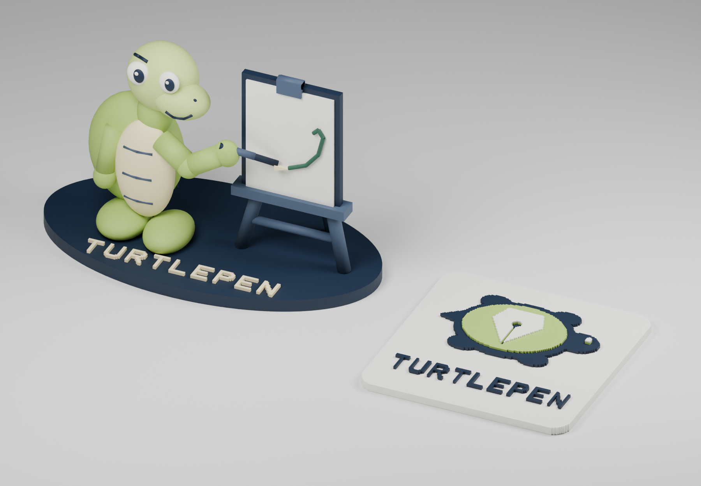
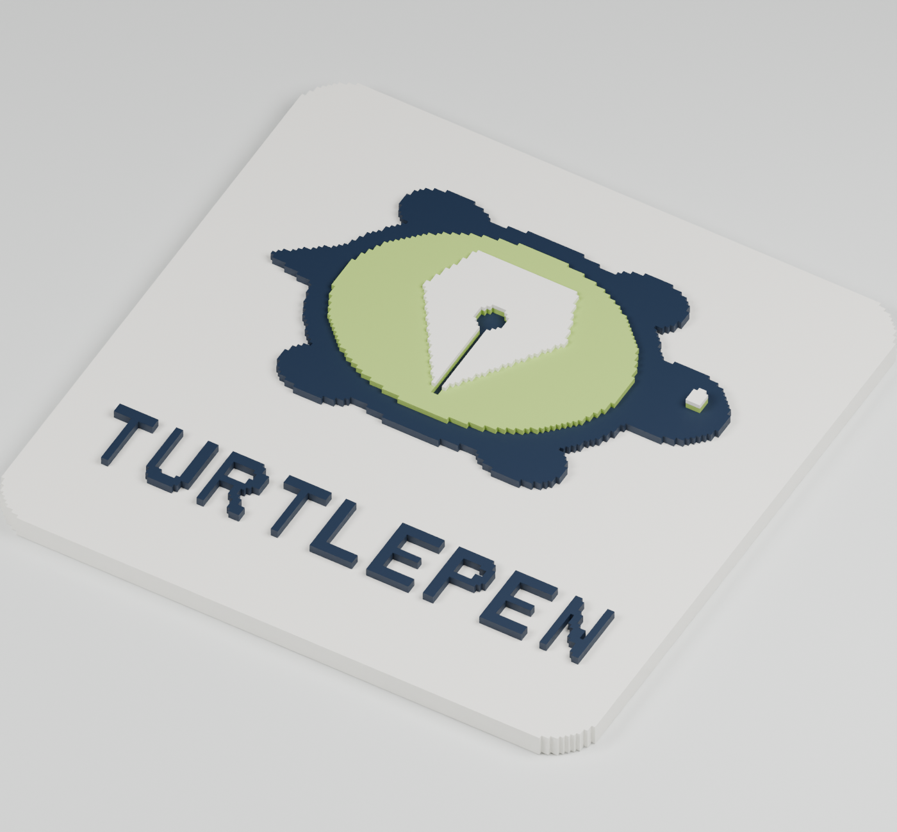

# TurtlePen: full 3D mascot and raised brand logo

Created 2026-09-08 from Chuck's request for both a full turtle-and-easel scene
and a raised logo redesigned as a brand mark. The existing canonical logo is
unchanged. These are new, editable design assets.



## Full 3D turtle and easel

- **[Colored model](full-logo.glb)** — 63 native TurtlePen parts: turtle, shell
  panels, expression, drawing arm, pen, easel, board and raised TURTLEPEN lettering.
- **[Joined STL](full-logo-solid.stl)** — approximately **134 × 74 × 87 mm**;
  one connected closed mesh, 338,128 triangles.
- **[Editable TurtlePen source](full-logo.tpf)** — original spatial primitives,
  colors and transforms. The wordmark is real native TurtleFont geometry.
- [Front preview](full-logo-front.png) · [Back preview](full-logo-back.png).

The colored model preserves overlapping construction parts. Its joined STL is
an explicitly derived Blender voxel union at **0.5 mm** resolution, with its
bottom placed at Z=0. It approximates the original surfaces and removes internal
overlap. One 0.001085 mm³ remeshing sliver was removed; exact bounds and the
operation are recorded in `fabrication-verification.json`. This downstream step
does not imply that TurtlePen's own boolean tool supports curved operands.

## Raised brand badge



The redesigned mark combines a simple turtle silhouette with a fountain-pen nib
in the shell. The breather hole and slit remain visible as recessed details.
The easel illustration becomes the mascot; the compact turtle-nib symbol serves
as the reusable brand mark.

- **[Badge STL](raised-brand-badge.stl)** — **84 × 84 × 5.6 mm**, one connected
  closed mesh, 117,276 triangles, with a continuous backing.
- **[Colored badge](raised-brand-badge-color.glb)** — palette and physical height
  bands shown as separate material parts.
- **[Badge source](raised-brand-badge.tpf)** and [colored source](raised-brand-badge-color.tpf).
- **[Full brand lockup](brand-mark.svg)** · [Icon only](brand-icon.svg) ·
  [Single-color lockup](brand-mark-single-color.svg).
- Corresponding `.turtlepen.json` files preserve editable native artwork.

The badge deliberately retains TurtlePen's quadrant-built character at
**0.5 mm per quadrant**. All backing and detail boundaries come from the same
native masks as the flat logo. Its height bands are:

| Height | Region | Preview color |
|---|---|---|
| 0–3 mm | Continuous rounded backing | Warm white |
| 3–4.2 mm | Turtle silhouette and wordmark | Navy |
| 4.2–5 mm | Shell and supported nib/eye detail | Lime |
| 5–5.6 mm | Nib and eye | Warm white |

STL does not store these colors; the GLB and flat SVGs do. Height bands are
geometry information, not a tested filament-change or printer profile.

## Verification and files

- Blender 5.0.1 independently imported the full GLB, badge GLB and native badge
  STL, checking component topology, physical bounds and volume.
- A separate Python binary-STL reader checked **both final STLs**: finite
  coordinates, exact file length, positive volume, zero degenerate triangles,
  consistent winding, two faces per edge, and one connected component each.
- All native brand documents pass TurtlePen validation. TPF imports and artifact
  hashes were checked; the original canonical logo's source hash is unchanged.
- Preview rendering smooths normals on curved mascot parts without changing
  their geometry. `logo-collection.blend` retains the staged colored collection.
- **Slicer acceptance, support generation and physical printing are untested.**
  Review the STL in your slicer before printing; the figurine contains overhangs.

Evidence: `receipts.json`, `design-receipt.json`, `blender-verification.json`,
`fabrication-verification.json`, `stl-byte-verification.json`, and
`source-verification.json`. TPF files use compact JSON to remain within the
prototype's import budget.

## Rebuild from the TurtlePen source checkout

```powershell
node examples/turtlepen-3d-logo.js
& 'C:/Program Files/Blender Foundation/Blender 5.0/blender.exe' --background --python-exit-code 1 --python examples/render-turtlepen-3d-logo.py -- artifacts/turtlepen-3d-logo
& 'C:/Program Files/Blender Foundation/Blender 5.0/blender.exe' --background --python-exit-code 1 --python examples/fuse-turtlepen-logo-blender.py -- artifacts/turtlepen-3d-logo
python examples/verify-turtlepen-logo-stl.py
```

Use your installed Blender path. `full-logo-construction.json` records the
native primitive commands plus wordmark construction parameters; it is a build
record, while `full-logo.tpf` is the directly importable scene.
