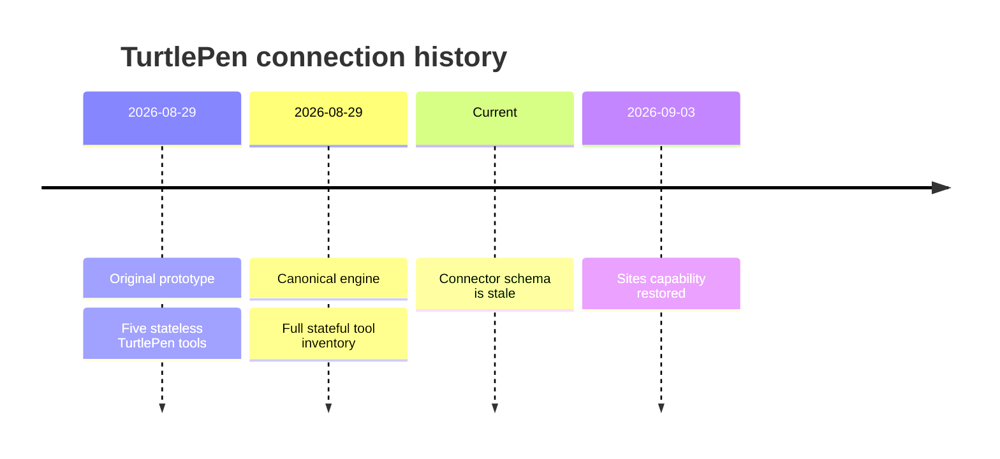

Improve TurtlePen by adding first-class semantic timeline support inspired by the clarity and efficiency of Mermaid timelines.

The objective is to let an agent describe chronology, phases, milestones, transitions, and grouped events without manually calculating every box, label, marker, and path. TurtlePen must compile the semantic timeline into its existing native, editable lattice primitives rather than introducing an isolated rendering system.

Before implementation, inspect the current TurtlePen architecture, capability registry, document model, layout system, Mermaid importer, validation rules, themes, constraints, SVG renderer, save format, MCP tools, help system, tests, and examples. Reuse the existing architecture wherever possible. Do not create a parallel diagram engine.

## Core architecture

Implement a native semantic timeline compiler that accepts structured timeline data and produces ordinary TurtlePen elements:

* Boxes
* Paths
* Stroke text or regular text
* Groups
* Pages
* Constraints
* Annotations
* Theme roles
* Stable element IDs

The compiled output must remain editable through existing TurtlePen operations such as `move`, `resize`, `restyle`, `reorder`, `duplicate`, `remove`, `group`, `constraint`, and `path_edit`.

A timeline must not become an opaque image or monolithic custom element.

Add a high-level MCP tool named `timeline`, unless existing architecture strongly supports a more consistent name. This tool should lay out a complete timeline from semantic input.

Suggested input contract:

```json
{
  "id": "turtlepen-history",
  "title": "TurtlePen connection history",
  "orientation": "vertical",
  "direction": "chronological",
  "at": "C4",
  "span": "48x36",
  "events": [
    {
      "id": "prototype",
      "date": "2026-08-29",
      "title": "Original prototype",
      "description": "Five stateless TurtlePen tools"
    },
    {
      "id": "canonical-engine",
      "date": "2026-08-29",
      "title": "Canonical engine",
      "description": "Replaced the prototype with the full stateful tool inventory"
    },
    {
      "id": "stale-connector",
      "title": "Connector became stale",
      "description": "ChatGPT retained the original five-tool schema"
    },
    {
      "id": "capability-restored",
      "date": "2026-09-03",
      "title": "Sites capability restored",
      "description": "Brainn.dev declared the supported MCP capability"
    }
  ]
}
```

## Timeline concepts

Support these semantic concepts:

* Point events
* Dated events
* Events without exact dates
* Date ranges
* Periods
* Phases
* Milestones
* Releases
* Deadlines
* Transitions
* Parallel tracks
* Categories
* Grouped events
* Parent and child events
* Status markers
* Uncertain or approximate dates
* Present-day or “now” markers
* Optional descriptions
* Optional supporting resources
* Optional semantic relationships between events

Dates should remain semantic metadata. They must not exist only as text labels.

Support ISO dates as the canonical input while allowing display labels such as:

* August 29
* Late August
* Q3 2026
* Before launch
* Current
* Planned
* Unknown

When a machine-readable date and display label are both supplied, preserve both.

## Layout modes

Support:

* Vertical timelines
* Horizontal timelines
* Alternating timelines
* Single-sided timelines
* Multi-track timelines
* Phase-band timelines
* Compact history timelines
* Detailed project timelines

Do not implement these as unrelated renderers. They should be layout policies over the same semantic model.

The default layout should favor readability and compactness. It should resemble the clarity of a good Mermaid timeline while preserving TurtlePen’s exact geometry.

The compiler should calculate:

* Axis placement
* Marker placement
* Event ordering
* Event-to-axis connectors
* Box dimensions
* Wrapped label dimensions
* Description placement
* Track spacing
* Phase band extents
* Gutter sizes
* Canvas expansion
* Title placement
* Balanced whitespace

Use `measure` before sizing text containers. Do not estimate label widths.

## Chronology and ordering

Events with valid dates should be ordered chronologically by default.

Events without exact dates must not be silently assigned invented dates. They may be placed according to their declared sequence and visually marked as undated or approximate.

Support an explicit ordering override.

When multiple events share the same date, preserve input order unless another sort key is provided.

Date ranges and phases must span the correct portion of the timeline. A phase should visually contain or cover its related events without falsely implying a more precise start or end than the source data provides.

## Scale behavior

Support two timeline spacing policies:

* `ordinal`, where events receive readable, evenly distributed positions
* `temporal`, where visual distance reflects actual elapsed time

Default to `ordinal` because real histories often contain long quiet periods and dense clusters.

When `temporal` spacing is selected, use TurtlePen’s quantitative scale system. Do not perform undocumented pixel calculations.

Clearly distinguish ordinal spacing from time-proportional spacing in metadata and inspection output.

## Collision-aware layout

Timeline compilation must use TurtlePen’s existing planning and validation systems.

The compiler should:

* Measure every label
* Reflow descriptions
* Alternate event sides when useful
* Increase gutters when needed
* Expand the canvas when necessary
* Move colliding labels
* Avoid axis and connector collisions
* Keep markers associated with the correct event
* Preserve minimum legibility
* Refuse layouts that cannot be represented truthfully

Do not silently truncate text.

Do not silently overlap events.

Do not shrink text below the legibility floor to force a layout to fit.

When a requested span is too small, return a precise explanation and recommend the minimum viable span.

## Visual hierarchy

Create semantic theme roles for timeline elements rather than hardcoding colors.

The theme system should be able to distinguish:

* Timeline axis
* Standard event
* Major milestone
* Phase
* Release
* Deadline
* Current event
* Planned event
* Approximate event
* Warning or failure
* Successful transition
* Supporting metadata

Use existing theme tokens and role mechanisms where possible.

The timeline should still work in monochrome. Meaning must not depend entirely on color.

Use shape, marker style, line pattern, label, or placement to preserve distinctions in monochrome output.

## Connectors and markers

Support meaningful marker variations such as:

* Circle for ordinary events
* Diamond for milestones
* Square for releases
* Triangle or another clearly documented symbol for deadlines
* Hollow marker for planned events
* Dashed connector for approximate or uncertain events
* Emphasized marker for the current state

Use TurtlePen-native lattice geometry.

Markers and event connectors must be individually inspectable and editable.

Stable IDs should be derived predictably from the timeline ID and event ID, for example:

```text
turtlepen-history.axis
turtlepen-history.prototype.marker
turtlepen-history.prototype.card
turtlepen-history.prototype.connector
```

Prevent ID collisions and report them clearly.

## Mermaid support

Expand `import_mermaid` to support Mermaid `timeline` syntax.

Example:



The importer must:

* Parse supported timeline syntax
* Preserve titles, dates, sections, and event text
* Return normal TurtlePen operations
* Feed those operations through `plan`
* Produce editable native elements
* Reject unsupported Mermaid features explicitly
* Never silently drop content
* Report ambiguity rather than inventing meaning

If practical, add export back to Mermaid timeline syntax when the TurtlePen timeline remains representable in Mermaid. If edits introduce concepts Mermaid cannot express, explain the loss instead of producing a misleading export.

## Inspection and semantics

Timeline-generated elements must remain understandable through `describe`, `inspect`, and `inspect_model`.

Add annotations that preserve:

* Timeline identity
* Event identity
* Event type
* Machine-readable date
* Display date
* Date precision
* Approximation status
* Parent phase
* Track
* Category
* Sequence
* Source resource
* Compilation origin

An inspecting agent should be able to reconstruct the timeline’s meaning without reverse-engineering its coordinates.

## Reflow and updates

A user must be able to add, remove, or update timeline events without rebuilding everything manually.

Provide a deterministic update path. This may be part of the `timeline` tool or a separate semantic update action.

Required behavior:

* Existing stable IDs remain stable
* Unchanged events retain their semantic identity
* Layout is recomputed when necessary
* Manual presentation overrides are preserved when safely possible
* Invalidated overrides are reported
* Removed events do not leave orphan connectors or constraints
* Updated dates cause correct reordering
* History and undo remain functional

Consider supporting actions such as:

```text
create
update
add_event
update_event
remove_event
reflow
inspect
```

Choose the final interface based on consistency with the existing TurtlePen tool architecture.

## Validation

Add timeline-specific semantic validation where general collision rules are insufficient.

Potential findings include:

* Event order contradicts its date
* Range ends before it begins
* Event falls outside its declared phase
* Marker is disconnected from its card
* Date label is ambiguous
* Event has neither a date nor explicit sequence
* Duplicate event ID
* Duplicate timeline ID
* Temporal spacing is not proportional to the declared scale
* Track assignment is missing
* Phase contains no events
* “Current” marker conflicts with the declared current date
* Approximate date is rendered as exact
* Event description is detached from the wrong marker

Use the existing severity and fingerprint system. Do not create an unrelated validation format.

## Workflow integration

The timeline tool must participate in TurtlePen’s normal verified workflow:

```text
measure
plan
commit
validate
inspect_model
render
look
perceptual_review
release_check
save
```

A timeline produced by the high-level tool must not bypass validation, history, rendering, or perceptual review.

The `plan` tool should support timeline operations in both rehearsal and committed batches.

## Help and discovery

Update:

* `turtlepen_help`
* `search_help`
* Capability registry
* Runtime tool inventory
* MCP schemas
* CLI help
* Examples
* README
* Relevant architectural documentation

Searching help for terms such as `timeline`, `chronology`, `history`, `milestone`, `roadmap`, `project history`, or `Mermaid timeline` should lead users to the feature.

Include concise examples for:

* Product history
* Incident timeline
* Project roadmap
* Release history
* Research chronology
* Personal biography
* Multi-track comparison
* Time-proportional historical events

## Testing

Add tests at the correct architectural layers.

Cover:

* Timeline schema validation
* Stable ID generation
* Chronological ordering
* Same-date ordering
* Undated events
* Approximate dates
* Date ranges
* Phases
* Multiple tracks
* Ordinal spacing
* Temporal spacing
* Text measurement and wrapping
* Small requested spans
* Canvas expansion
* Collision avoidance
* Mermaid timeline parsing
* Unsupported Mermaid syntax
* Semantic annotations
* Theme roles
* Monochrome readability
* SVG output
* Save and reopen
* History undo and redo
* Event updates
* Event removal
* Deterministic output
* Existing diagrams and tools remaining unchanged

Include visual or golden fixtures where appropriate, but do not rely only on snapshots. Assert the underlying semantic model and exact lattice geometry.

## Reference fixture

Use the TurtlePen connection history as the first complete reference fixture:

* Original five-tool stateless prototype
* Canonical stateful TurtlePen engine introduced on August 29, 2026
* Installed beta connector retained the obsolete schema
* Sites MCP discovery declaration was removed after using an unsupported key
* Correct MCP capability declaration published on September 3, 2026
* Native Sites MCP access remains controlled by an account-level feature setting

Generate this fixture in both vertical and horizontal layouts.

Compare the result against the supplied Mermaid timeline for information clarity, chronological readability, hierarchy, compactness, and visual balance.

Do not copy Mermaid’s visual implementation directly. Use it as a quality benchmark.

## Acceptance criteria

The work is complete when:

* TurtlePen can generate a readable timeline from semantic event data
* The result consists of ordinary editable TurtlePen elements
* Vertical and horizontal layouts work
* Ordinal and temporal spacing are distinguishable and correct
* Labels are measured and not silently truncated
* Timeline updates preserve stable semantic identities
* Mermaid timeline input compiles into native TurtlePen operations
* Validation catches misleading chronological representations
* The capability appears in live MCP discovery
* Help and examples make the feature discoverable
* Existing TurtlePen behavior remains compatible
* Tests pass
* The reference TurtlePen history fixture renders clearly
* The final artifact passes structural and perceptual review

Document architectural decisions, limitations, and any intentionally deferred features. Do not claim completion for partial parsing, a hardcoded reference diagram, or an opaque SVG-only renderer.
